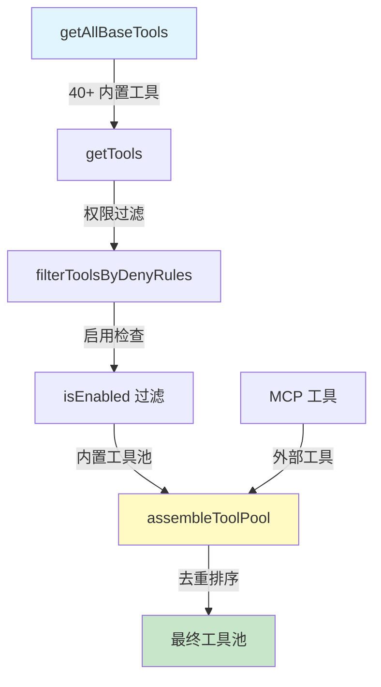
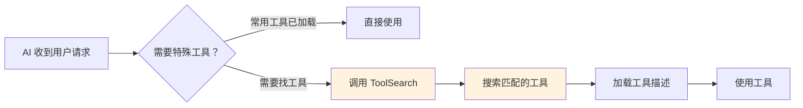

# 第一课：超级工具箱 —— 40 种开发工具详解

> 🎯 对应漫画：第 1 张《超级工具箱》

---

## 学习目标

1. 理解 Claude Code 的工具系统架构：从定义到注册到调用的完整链路
2. 掌握 `Tool` 接口的核心设计思想及其各字段含义
3. 了解 40+ 种内置工具的分类与功能
4. 学会工具池的组装与过滤机制（内置工具 + MCP 工具）
5. 理解工具搜索（ToolSearch）延迟加载的优化策略

---

## 一、生活类比：你的瑞士军刀

想象你是一个装修师傅，面前有一个超大工具箱：

- **螺丝刀**（BashTool）—— 万能基础工具，什么都能拧
- **卷尺**（FileReadTool）—— 测量、查看、了解情况
- **电钻**（FileEditTool）—— 精确修改，快速高效
- **对讲机**（AgentTool）—— 呼叫助手来帮忙
- **安全帽**（权限系统）—— 每个工具使用前都要检查安全

Claude Code 就像一个**智能工具管理系统**：它知道你手里有哪些工具，每个工具能干什么，哪些需要戴安全帽才能用。

---

## 二、工具的"身份证"：Tool 接口

每个工具都有一张详细的"身份证"，定义在 `Tool.ts` 中：

```typescript
// 源码：Tool.ts（简化版）
export type Tool<Input, Output, P> = {
  name: string                    // 工具名称
  description(input): string      // 工具描述（给 AI 看的）
  inputSchema: Input              // 输入参数定义
  call(args, context): Result     // 核心：执行函数
  isEnabled(): boolean            // 是否启用
  isReadOnly(input): boolean      // 是否只读操作
  isDestructive?(input): boolean  // 是否有破坏性
  isConcurrencySafe(input): boolean  // 是否可并行
  checkPermissions(input, ctx): PermissionResult  // 权限检查
  maxResultSizeChars: number      // 结果最大字符数
}
```

### 关键字段解读

| 字段 | 作用 | 生活类比 |
|------|------|----------|
| `name` | 工具唯一标识 | 工具上的品牌标签 |
| `isReadOnly` | 是否只是"看"不"改" | 卷尺只看不改，电钻会改 |
| `isDestructive` | 操作能否撤销 | 拆墙不可逆，钉钉子可逆 |
| `isConcurrencySafe` | 能否多个同时用 | 两把卷尺可以同时量，两把电钻不能同时钻一个孔 |
| `checkPermissions` | 使用前安全检查 | 操作危险工具需要签安全协议 |
| `maxResultSizeChars` | 结果大小限制 | 报告太长就存文件，只给摘要 |

---

## 三、工具注册中心：tools.ts

所有工具在 `tools.ts` 中集中注册，这是工具系统的"入口大厅"：

```typescript
// 源码：tools.ts — getAllBaseTools 函数
export function getAllBaseTools(): Tools {
  return [
    AgentTool,          // 子代理工具
    TaskOutputTool,     // 任务输出
    BashTool,           // Shell 命令执行
    GlobTool,           // 文件模式搜索
    GrepTool,           // 内容搜索
    FileReadTool,       // 文件读取
    FileEditTool,       // 文件编辑
    FileWriteTool,      // 文件写入
    NotebookEditTool,   // Jupyter 笔记本编辑
    WebFetchTool,       // 网页获取
    TodoWriteTool,      // 待办管理
    WebSearchTool,      // 网页搜索
    TaskStopTool,       // 停止任务
    AskUserQuestionTool,// 向用户提问
    SkillTool,          // 技能调用
    EnterPlanModeTool,  // 进入计划模式
    // ... 更多条件加载的工具
  ]
}
```

### 工具的条件加载

很多工具不是一直存在的，而是根据环境**按需加载**：

```typescript
// 源码：tools.ts — 条件加载示例
const SleepTool =
  feature('PROACTIVE') || feature('KAIROS')
    ? require('./tools/SleepTool/SleepTool.js').SleepTool
    : null

// Worktree 模式工具
...(isWorktreeModeEnabled()
  ? [EnterWorktreeTool, ExitWorktreeTool] : []),

// Agent Swarm 模式工具
...(isAgentSwarmsEnabled()
  ? [getTeamCreateTool(), getTeamDeleteTool()] : []),
```

这就像一个智能工具箱——如果你在做木工，它自动显示木工工具；如果你在做电工，它显示电工工具。

---

## 四、40+ 工具大全分类

### 4.1 文件操作类（"手术刀系列"）

| 工具 | 功能 | 只读？ |
|------|------|--------|
| `FileReadTool` | 读取文件内容 | ✅ |
| `FileEditTool` | 精确编辑文件 | ❌ |
| `FileWriteTool` | 创建/覆写文件 | ❌ |
| `NotebookEditTool` | 编辑 Jupyter Notebook | ❌ |
| `GlobTool` | 按模式搜索文件名 | ✅ |
| `GrepTool` | 按内容搜索文件 | ✅ |

### 4.2 命令执行类（"发动机系列"）

| 工具 | 功能 |
|------|------|
| `BashTool` | 执行 Shell 命令 |
| `PowerShellTool` | Windows PowerShell 执行 |
| `REPLTool` | 交互式 REPL 环境（内部） |

### 4.3 代理协作类（"通讯系列"）

| 工具 | 功能 |
|------|------|
| `AgentTool` | 创建子代理执行任务 |
| `TaskOutputTool` | 获取任务输出 |
| `TaskStopTool` | 停止运行中的任务 |
| `SendMessageTool` | 向已有代理发消息 |
| `TeamCreateTool` | 创建团队（Swarm 模式） |
| `TeamDeleteTool` | 删除团队 |

### 4.4 信息获取类（"望远镜系列"）

| 工具 | 功能 |
|------|------|
| `WebFetchTool` | 获取网页内容 |
| `WebSearchTool` | 搜索互联网 |
| `LSPTool` | 语言服务器协议查询 |
| `ToolSearchTool` | 搜索可用工具 |

### 4.5 计划与管理类（"指挥系列"）

| 工具 | 功能 |
|------|------|
| `EnterPlanModeTool` | 进入计划模式 |
| `ExitPlanModeV2Tool` | 退出计划模式 |
| `TodoWriteTool` | 管理待办事项 |
| `TaskCreateTool` | 创建新任务 |
| `TaskGetTool` | 获取任务状态 |
| `TaskUpdateTool` | 更新任务 |
| `TaskListTool` | 列出所有任务 |

### 4.6 扩展与集成类（"插件系列"）

| 工具 | 功能 |
|------|------|
| `SkillTool` | 调用自定义技能 |
| `ListMcpResourcesTool` | 列出 MCP 资源 |
| `ReadMcpResourceTool` | 读取 MCP 资源 |
| `ConfigTool` | 配置管理 |

---

## 五、工具池组装：三步合一



对应的核心源码：

```typescript
// 源码：tools.ts — assembleToolPool
export function assembleToolPool(
  permissionContext: ToolPermissionContext,
  mcpTools: Tools,
): Tools {
  const builtInTools = getTools(permissionContext)
  const allowedMcpTools = filterToolsByDenyRules(mcpTools, permissionContext)

  // 内置工具排在前面（缓存友好），MCP 工具在后面
  const byName = (a: Tool, b: Tool) => a.name.localeCompare(b.name)
  return uniqBy(
    [...builtInTools].sort(byName).concat(allowedMcpTools.sort(byName)),
    'name',  // 同名时内置工具优先
  )
}
```

### 为什么这么设计？

1. **内置优先**：同名工具内置版本优先，防止 MCP 工具覆盖核心功能
2. **排序稳定**：按名称排序保证**提示缓存**的稳定性（prompt cache stability）
3. **权限前置**：被拒绝的工具直接从列表移除，AI 根本看不到它们

---

## 六、工具构建器：buildTool 工厂

为了避免每个工具都写一堆样板代码，Claude Code 提供了 `buildTool` 工厂函数：

```typescript
// 源码：Tool.ts — buildTool
const TOOL_DEFAULTS = {
  isEnabled: () => true,
  isConcurrencySafe: () => false,      // 默认不允许并行（安全优先）
  isReadOnly: () => false,              // 默认假设会写入
  isDestructive: () => false,
  checkPermissions: (input) =>          // 默认交给通用权限系统
    Promise.resolve({ behavior: 'allow', updatedInput: input }),
  toAutoClassifierInput: () => '',
}

export function buildTool<D extends AnyToolDef>(def: D): BuiltTool<D> {
  return {
    ...TOOL_DEFAULTS,
    userFacingName: () => def.name,
    ...def,  // 用户自定义覆盖默认值
  }
}
```

### 设计哲学：安全关闭原则（Fail-Closed）

| 默认值 | 含义 | 安全策略 |
|--------|------|----------|
| `isConcurrencySafe = false` | 默认不并行 | 防止竞态条件 |
| `isReadOnly = false` | 默认假设写入 | 需要更严格的权限 |
| `isDestructive = false` | 默认非破坏性 | 特殊工具需要主动声明 |

---

## 七、工具搜索：ToolSearch 延迟加载

当工具太多时，把所有工具描述都放进提示词会消耗大量 token。解决方案：**延迟加载**。



```typescript
// 源码：tools.ts — 工具搜索条件加载
...(isToolSearchEnabledOptimistic()
  ? [ToolSearchTool] : []),
```

每个工具还有 `searchHint` 字段帮助搜索匹配：

```typescript
// 工具定义中的搜索提示
searchHint?: string  // 如 NotebookEditTool 的 searchHint 是 'jupyter'
```

---

## 八、动手练习

### 练习 1：画出工具调用流程

根据本课内容，画出从 "用户输入请求" 到 "工具返回结果" 的完整流程图，包含：
- 工具选择
- 权限检查
- 输入验证
- 执行调用
- 结果处理

### 练习 2：设计一个新工具

假设你要为 Claude Code 设计一个 `DatabaseQueryTool`：

1. 它应该是只读还是可写？
2. 是否需要并发安全？
3. `maxResultSizeChars` 应该设多大？
4. 需要什么权限检查逻辑？

### 思考题

1. 为什么 `GlobTool` 和 `GrepTool` 在嵌入搜索工具可用时会被移除？
2. `assembleToolPool` 为什么要把内置工具排在 MCP 工具前面？
3. 如果一个工具的 `isEnabled()` 返回 `false`，它和被 deny 规则拒绝有什么区别？

---

## 九、本课小结

| 知识点 | 核心内容 |
|--------|----------|
| Tool 接口 | 每个工具的"身份证"，定义输入输出、权限、行为 |
| 工具注册 | `getAllBaseTools()` 集中注册，条件加载 |
| 工具池组装 | 内置 + MCP，权限过滤，去重排序 |
| buildTool | 工厂函数，安全默认值，减少样板代码 |
| ToolSearch | 延迟加载，解决工具过多的 token 问题 |

**一句话总结**：Claude Code 的工具系统就像一个**智能工具管理平台**，它不仅知道有什么工具、每个工具怎么用，还能根据环境动态调整工具箱、根据权限控制谁能用什么工具。

---

## 下节预告

> **第二课：多代理军团 —— Agent Swarm 协同机制**
>
> 一个人干活快，还是一群人干活快？下节课我们深入 `AgentTool` 和 Coordinator 模式，
> 看看 Claude Code 如何**同时派出多个 AI 代理**并行工作，像军团一样协同完成复杂任务！
