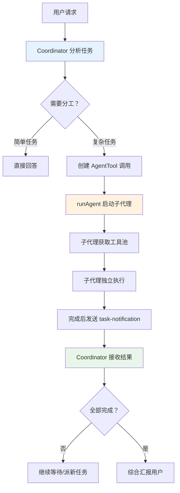
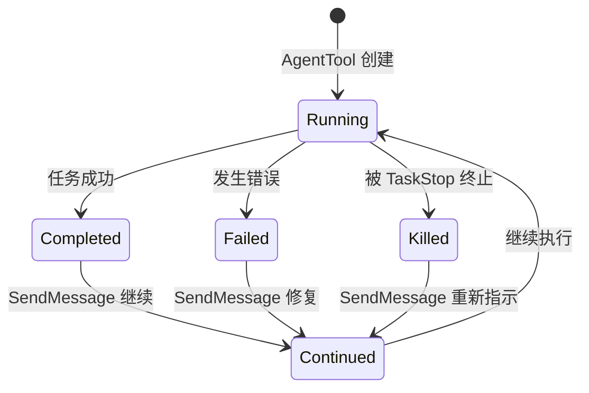
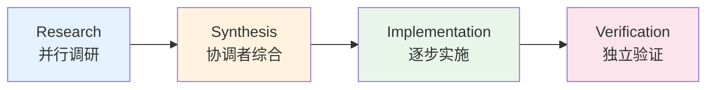

# 第二课：多代理军团 —— Agent Swarm 协同机制

> 🎯 对应漫画：第 2 张《多代理军团》

---

## 学习目标

1. 理解 Coordinator（协调者）与 Worker（工人）的分工模式
2. 掌握 AgentTool 的核心设计：如何创建和管理子代理
3. 了解多代理协同的四阶段工作流（研究→综合→实施→验证）
4. 理解代理之间的通信机制（task-notification 协议）
5. 学会并行与串行任务编排的最佳实践

---

## 一、生活类比：建筑工地的项目经理

想象你是一个**项目经理**（Coordinator），要装修一栋大楼：

- 你不需要亲自砌墙、装电线、铺地砖
- 你的工作是：**分解任务、分配工人、协调进度、整合成果**
- 工人（Worker）各自独立工作，完成后向你汇报
- 有的任务可以并行（不同楼层同时装修），有的必须串行（先打地基再盖楼）

Claude Code 的 Coordinator 模式就是这种**项目经理 + 工人**的协作模式。

---

## 二、协调者模式的开启

Coordinator 模式在 `coordinatorMode.ts` 中定义：

```typescript
// 源码：coordinator/coordinatorMode.ts
export function isCoordinatorMode(): boolean {
  if (feature('COORDINATOR_MODE')) {
    return isEnvTruthy(process.env.CLAUDE_CODE_COORDINATOR_MODE)
  }
  return false
}
```

### 协调者的系统提示词

当协调者模式启用后，会注入一段专用的系统提示词：

```typescript
// 源码：coordinator/coordinatorMode.ts — getCoordinatorSystemPrompt
export function getCoordinatorSystemPrompt(): string {
  return `You are Claude Code, an AI assistant that orchestrates
software engineering tasks across multiple workers.

## 1. Your Role
You are a **coordinator**. Your job is to:
- Help the user achieve their goal
- Direct workers to research, implement and verify code changes
- Synthesize results and communicate with the user
- Answer questions directly when possible

## 2. Your Tools
- **Task** - Spawn a new worker
- **SendMessage** - Continue an existing worker
- **TaskStop** - Stop a running worker
...`
}
```

---

## 三、AgentTool：子代理的诞生

AgentTool 是整个多代理系统的**入口**。它负责创建子代理、分配任务、管理生命周期。

### 3.1 输入参数设计

```typescript
// 源码：tools/AgentTool/AgentTool.tsx — 输入 Schema
const baseInputSchema = lazySchema(() => z.object({
  description: z.string()
    .describe('A short (3-5 word) description of the task'),
  prompt: z.string()
    .describe('The task for the agent to perform'),
  subagent_type: z.string().optional()
    .describe('The type of specialized agent to use'),
  model: z.enum(['sonnet', 'opus', 'haiku']).optional()
    .describe("Optional model override for this agent"),
  run_in_background: z.boolean().optional()
    .describe('Set to true to run this agent in the background')
}));
```

### 3.2 代理运行流程



---

## 四、代理的工具池：Worker 能用什么？

Worker 代理不是什么工具都能用的。Coordinator 模式下有专门的过滤：

```typescript
// 源码：coordinator/coordinatorMode.ts — getCoordinatorUserContext
export function getCoordinatorUserContext(
  mcpClients: ReadonlyArray<{ name: string }>,
  scratchpadDir?: string,
): { [k: string]: string } {
  const workerTools = isEnvTruthy(process.env.CLAUDE_CODE_SIMPLE)
    ? [BASH_TOOL_NAME, FILE_READ_TOOL_NAME, FILE_EDIT_TOOL_NAME]
        .sort().join(', ')
    : Array.from(ASYNC_AGENT_ALLOWED_TOOLS)
        .filter(name => !INTERNAL_WORKER_TOOLS.has(name))
        .sort().join(', ')

  let content = `Workers spawned via the Task tool have access
    to these tools: ${workerTools}`

  if (mcpClients.length > 0) {
    content += `\n\nWorkers also have access to MCP tools
      from connected MCP servers: ${serverNames}`
  }

  return { workerToolsContext: content }
}
```

### 工具分配示意

| 角色 | 可用工具 | 不可用工具 |
|------|----------|------------|
| Coordinator | AgentTool, SendMessage, TaskStop | Bash, FileEdit 等执行工具 |
| Worker | Bash, FileRead, FileEdit, Grep... | AgentTool（不能再派子代理） |

这就像项目经理不拿锤子干活，工人不能再雇工人。

---

## 五、代理通信协议：task-notification

Worker 完成任务后，通过 XML 格式的通知消息向 Coordinator 汇报：

```xml
<task-notification>
  <task-id>agent-a1b</task-id>
  <status>completed</status>
  <summary>Agent "Investigate auth bug" completed</summary>
  <result>Found null pointer in src/auth/validate.ts:42...</result>
  <usage>
    <total_tokens>15000</total_tokens>
    <tool_uses>8</tool_uses>
    <duration_ms>45000</duration_ms>
  </usage>
</task-notification>
```

### 三种任务状态



---

## 六、四阶段工作流

Coordinator 模式推荐的标准工作流：

### 阶段 1：Research（研究）
```
目标：了解问题，多角度调查
并行度：高（多个 Worker 同时调研不同方向）
Worker 限制：只读操作，不修改文件
```

### 阶段 2：Synthesis（综合）
```
执行者：Coordinator 自己
任务：阅读 Worker 汇报，理解问题，制定方案
关键：绝不偷懒地说 "based on your findings"
```

### 阶段 3：Implementation（实施）
```
并行度：低（同一文件区域一次一个 Worker）
Worker 任务：按照具体规格修改代码
自验证：Worker 修改后自行跑测试
```

### 阶段 4：Verification（验证）
```
执行者：新的 Worker（不是实施的那个）
原因：新鲜视角，不带实现偏见
要求：证明代码工作，而非确认它存在
```



---

## 七、runAgent：代理运行引擎

`runAgent.ts` 是子代理的核心运行时，它做以下事情：

```typescript
// 源码：tools/AgentTool/runAgent.ts（简化概念）
export async function runAgent(params) {
  // 1. 创建代理上下文
  const subagentContext = createSubagentContext(...)

  // 2. 获取系统提示词
  const systemPrompt = await buildEffectiveSystemPrompt(...)

  // 3. 组装工具池
  const tools = assembleToolPool(permissionContext, mcpTools)

  // 4. 执行查询循环
  const result = await query({
    messages,
    systemPrompt,
    tools,
    model: agentModel,
    // ...
  })

  // 5. 记录结果、清理资源
  await recordSidechainTranscript(...)
}
```

### Worktree 隔离

Worker 可以在独立的 Git Worktree 中工作，不影响主分支：

```typescript
// AgentTool 的 isolation 参数
isolation: z.enum(['worktree', 'remote']).optional()
  .describe('Isolation mode. "worktree" creates a temporary git worktree...')
```

这就像给每个工人一个**独立的工作间**——他们可以大胆修改，互不干扰，最后再合并成果。

---

## 八、续写对话：SendMessage

`SendMessage` 让 Coordinator 可以**继续已有 Worker 的对话**，而不是每次都创建新的：

```typescript
// 协调者使用 SendMessage 继续 Worker
SendMessage({
  to: "agent-a1b",
  message: "Fix the null pointer in src/auth/validate.ts:42..."
})
```

### 何时续写 vs 新建？

| 场景 | 选择 | 原因 |
|------|------|------|
| 研究后实施同一区域 | 续写 | Worker 已有文件上下文 |
| 修复刚失败的尝试 | 续写 | Worker 知道错误详情 |
| 验证别人写的代码 | 新建 | 需要新鲜视角 |
| 完全不相关的任务 | 新建 | 没有上下文可复用 |
| 之前方向完全错误 | 新建 | 错误上下文会干扰 |

---

## 九、Scratchpad：跨 Worker 共享知识

当 Scratchpad 功能启用时，Worker 之间可以通过共享目录交换信息：

```typescript
// 源码：coordinator/coordinatorMode.ts
if (scratchpadDir && isScratchpadGateEnabled()) {
  content += `\n\nScratchpad directory: ${scratchpadDir}
Workers can read and write here without permission prompts.
Use this for durable cross-worker knowledge.`
}
```

这就像工地上的**公告板**——任何工人都可以在上面写信息、看信息。

---

## 十、动手练习

### 练习 1：设计一个多代理任务

假设用户请求："重构项目的数据库层，从 MySQL 迁移到 PostgreSQL"。

设计你的 Coordinator 工作计划：
1. 需要几个研究阶段的 Worker？分别调查什么？
2. 综合阶段你会关注哪些关键决策？
3. 实施阶段如何安排 Worker 的顺序？
4. 验证阶段需要检查什么？

### 练习 2：判断续写还是新建

以下场景，你会选择 `SendMessage` 还是新建 `AgentTool`？

1. Worker A 调研完数据库 schema，现在要修改迁移脚本
2. Worker B 的测试失败了，需要修复
3. 需要验证 Worker C 刚提交的代码
4. 用户突然改需求，之前的方向完全错了

### 思考题

1. 为什么 Coordinator 不直接执行 Bash 命令，而是通过 Worker 来做？
2. 为什么验证阶段要用新的 Worker 而不是让实施的 Worker 自己验证？
3. Scratchpad 和数据库相比，作为 Worker 间通信方式有什么优劣？

---

## 十一、本课小结

| 知识点 | 核心内容 |
|--------|----------|
| Coordinator 模式 | 协调者负责分工与综合，Worker 负责执行 |
| AgentTool | 创建子代理的入口，定义任务、模型、隔离级别 |
| 四阶段工作流 | 研究→综合→实施→验证，层层递进 |
| task-notification | XML 格式的代理间通信协议 |
| SendMessage | 续写已有 Worker 对话，复用上下文 |
| Worktree 隔离 | 独立 Git 工作区，互不干扰 |

**一句话总结**：Claude Code 的多代理系统就像一个**高效的项目管理团队**——项目经理分解任务、分配工人、协调进度，工人们并行工作、各司其职，最终所有成果由项目经理整合交付。

---

## 下节预告

> **第三课：三层安全锁 —— 权限安全体系深入**
>
> 给 AI 发工具是好事，但如果它乱用怎么办？下节课我们深入权限系统，
> 看看 Claude Code 如何用**三层安全锁**保障每一个操作都安全可控！
