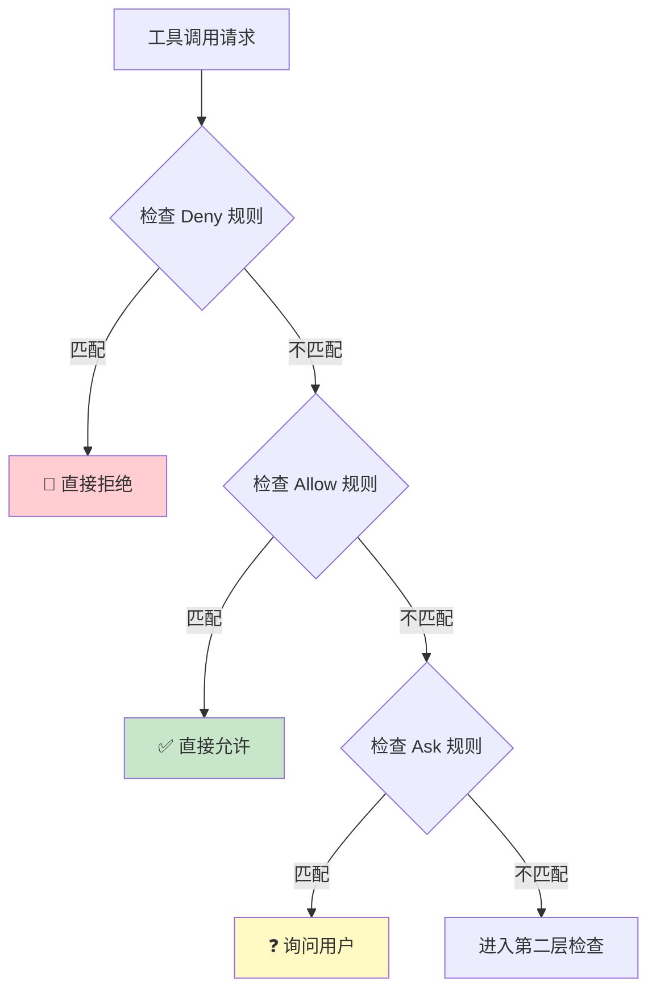
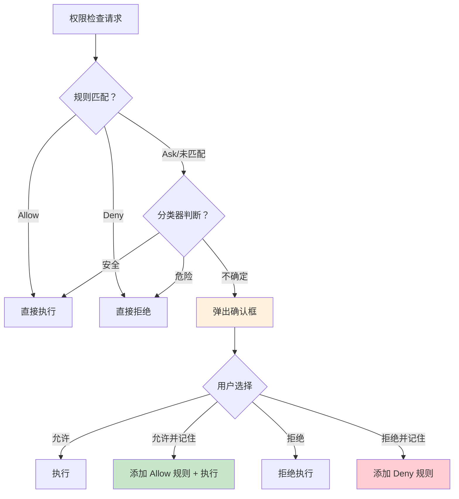
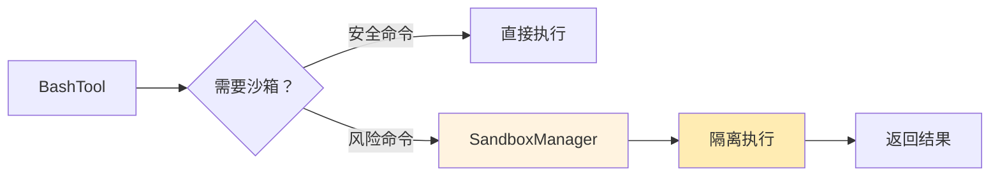
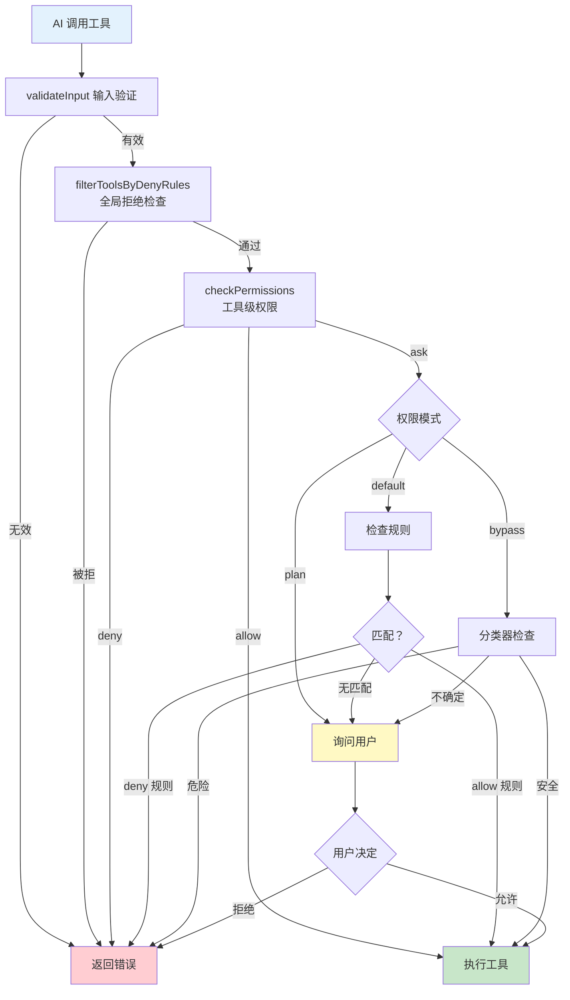

# 第三课：三层安全锁 —— 权限安全体系深入

> 🎯 对应漫画：第 3 张《三层安全锁》

---

## 学习目标

1. 理解 Claude Code 权限系统的三层架构（规则匹配→分类器→用户审批）
2. 掌握权限模式（default / plan / auto）的行为差异
3. 了解权限规则的来源、优先级与匹配逻辑
4. 理解 YOLO 分类器的安全机制
5. 学会如何配置自定义权限规则

---

## 一、生活类比：银行保险柜

想象你去银行取钱：

- **第一道门**：门禁卡（规则匹配）—— 你的名字在允许名单上吗？
- **第二道门**：安全扫描（分类器）—— 你的行为是否可疑？
- **第三道门**：柜员确认（用户审批）—— 请签名确认操作

Claude Code 的权限系统也是这样三层设计——每执行一个工具操作前，必须通过所有安全检查。

---

## 二、权限模式：三种安全等级

### 2.1 模式概览

```typescript
// 源码：types/permissions.ts
export type PermissionMode = 'default' | 'plan' | 'bypassPermissions'
```

| 模式 | 安全等级 | 行为 | 适合场景 |
|------|----------|------|----------|
| `default` | 标准 | 敏感操作需要确认 | 日常开发 |
| `plan` | 严格 | 所有写操作需要确认 | 规划阶段 |
| `bypassPermissions` | 宽松 | 自动批准（有分类器兜底） | 信任场景 |

### 2.2 权限上下文

每次检查权限时，系统会携带完整的上下文信息：

```typescript
// 源码：Tool.ts — ToolPermissionContext
export type ToolPermissionContext = DeepImmutable<{
  mode: PermissionMode                    // 当前安全模式
  additionalWorkingDirectories: Map<...>  // 允许的工作目录
  alwaysAllowRules: ToolPermissionRulesBySource  // 永远允许的规则
  alwaysDenyRules: ToolPermissionRulesBySource   // 永远拒绝的规则
  alwaysAskRules: ToolPermissionRulesBySource    // 永远询问的规则
  isBypassPermissionsModeAvailable: boolean      // 是否可跳过权限
  shouldAvoidPermissionPrompts?: boolean  // 后台代理不弹窗
}>
```

注意 `DeepImmutable` —— 权限上下文是**不可变的**，防止运行时被篡改。

---

## 三、第一层：规则匹配

### 3.1 三种规则类型



### 3.2 规则来源与优先级

```typescript
// 源码：utils/permissions/permissions.ts
const PERMISSION_RULE_SOURCES = [
  ...SETTING_SOURCES,  // 设置文件来源
  'cliArg',            // 命令行参数
  'command',           // 命令级别
  'session',           // 会话级别
] as const
```

规则可以来自多个地方，形成层级：

| 优先级 | 来源 | 文件位置 | 说明 |
|--------|------|----------|------|
| 最高 | 企业策略 | 管理员配置 | 不可覆盖 |
| 高 | 用户设置 | `~/.claude/settings.json` | 全局偏好 |
| 中 | 项目设置 | `.claude/settings.json` | 项目级别 |
| 低 | 会话级 | 运行时 | 当前对话 |

### 3.3 工具级 Deny 规则过滤

一个重要的优化——如果某个工具被全局拒绝，它甚至不会出现在 AI 的工具列表中：

```typescript
// 源码：tools.ts — filterToolsByDenyRules
export function filterToolsByDenyRules<T extends { name: string }>(
  tools: readonly T[],
  permissionContext: ToolPermissionContext
): T[] {
  return tools.filter(
    tool => !getDenyRuleForTool(permissionContext, tool)
  )
}
```

**设计哲学**：不是"看到了但不让用"，而是"压根看不到"。这比运行时拒绝更安全——AI 无法尝试使用它根本不知道存在的工具。

---

## 四、第二层：分类器（Classifier）

### 4.1 YOLO 分类器

当处于自动模式（bypass permissions）时，不是所有操作都直接放行——还有一个**安全分类器**做最后把关：

```typescript
// 源码：utils/permissions/yoloClassifier.ts（概念）
export function classifyYoloAction(
  toolName: string,
  input: unknown,
  context: ClassifierContext
): 'allow' | 'deny' | 'ask'
```

分类器会分析操作的**风险等级**：

| 操作类型 | 风险评估 | 分类结果 |
|----------|----------|----------|
| 读取文件 | 低风险 | allow |
| 修改项目内文件 | 中风险 | allow（在项目目录内） |
| 执行 `rm -rf` | 高风险 | deny |
| 访问 `/etc/passwd` | 高风险 | deny |
| 安装未知包 | 中高风险 | ask |

### 4.2 Bash 命令的特殊分类

Shell 命令是最危险的工具之一，有专门的分类器：

```typescript
// 源码：utils/permissions/bashClassifier.ts（概念）
// 分类 shell 命令的安全性
// 检查：命令类型、目标路径、参数、管道链等
```

### 4.3 拒绝追踪

系统会追踪连续被拒绝的次数，超过阈值后会改变行为：

```typescript
// 源码：utils/permissions/denialTracking.ts
export const DENIAL_LIMITS = { /* 拒绝次数阈值 */ }

export function shouldFallbackToPrompting(
  state: DenialTrackingState
): boolean {
  // 连续被拒绝太多次 → 回退到询问用户
}
```

---

## 五、第三层：用户审批

### 5.1 审批流程

当前两层都无法确定时，会弹出交互式确认：



### 5.2 权限更新的持久化

用户的选择可以被保存，下次不再询问：

```typescript
// 源码：utils/permissions/PermissionUpdate.ts
export function applyPermissionUpdate(
  update: PermissionUpdate,
  destination: PermissionUpdateDestination
): void {
  // 将用户的允许/拒绝决策持久化到配置文件
}
```

---

## 六、工具级别的权限检查

每个工具还可以定义自己的权限逻辑：

```typescript
// 源码：Tool.ts — checkPermissions 方法
checkPermissions(
  input: z.infer<Input>,
  context: ToolUseContext,
): Promise<PermissionResult>
```

### PermissionResult 的三种行为

```typescript
// 概念代码
type PermissionResult =
  | { behavior: 'allow', updatedInput: Input }   // 允许
  | { behavior: 'deny', message: string }         // 拒绝
  | { behavior: 'ask', message: string }          // 询问
```

### 实际示例

BashTool 的权限检查需要分析命令内容：
- `ls -la` → 只读，通常允许
- `rm important_file` → 写入，需要确认
- `curl ... | bash` → 危险，需要严格审查

---

## 七、文件系统保护

### 7.1 路径验证

```typescript
// 源码：utils/permissions/pathValidation.ts（概念）
// 确保操作在允许的目录内
// 阻止越权访问（如 ../../etc/passwd）
```

### 7.2 工作目录限制

```typescript
// ToolPermissionContext 中的目录控制
additionalWorkingDirectories: Map<string, AdditionalWorkingDirectory>
```

Agent 只能在以下位置操作：
1. 当前工作目录及其子目录
2. 显式添加的额外工作目录
3. 临时目录（有限制）

---

## 八、沙箱执行

对于高风险操作，Claude Code 还支持沙箱执行：

```typescript
// 源码：utils/sandbox/sandbox-adapter.ts（概念）
export class SandboxManager {
  // 在隔离环境中执行命令
  // 限制网络、文件系统访问
}
```



---

## 九、权限流程总览



---

## 十、动手练习

### 练习 1：权限规则设计

为一个团队项目设计权限规则：
- 允许所有读操作
- 允许修改 `src/` 目录下的文件
- 禁止修改 `.env` 和 `credentials.json`
- 禁止执行 `rm -rf` 命令
- `git push` 需要确认

写出对应的规则配置。

### 练习 2：追踪权限决策

假设 AI 执行以下操作序列，追踪每一步的权限决策路径：

1. `FileRead("src/app.ts")`
2. `FileEdit("src/app.ts", ...)`
3. `Bash("npm test")`
4. `Bash("rm -rf node_modules")`
5. `FileWrite("/etc/hosts", ...)`

### 思考题

1. 为什么权限上下文要用 `DeepImmutable`？如果运行时可以修改会有什么风险？
2. 连续拒绝追踪（denial tracking）解决了什么问题？
3. 为什么沙箱执行不是默认启用的？

---

## 十一、本课小结

| 知识点 | 核心内容 |
|--------|----------|
| 三层架构 | 规则匹配 → 分类器 → 用户审批 |
| 权限模式 | default（标准）、plan（严格）、bypass（宽松+分类器） |
| 规则来源 | 企业策略 > 用户设置 > 项目设置 > 会话级 |
| 工具过滤 | 被 deny 的工具从列表中移除，AI 看不到 |
| 分类器 | 自动模式的安全兜底，分析操作风险 |
| 用户审批 | 最后防线，支持"记住选择" |

**一句话总结**：Claude Code 的权限系统就像银行保险柜的三道门——规则匹配是门禁卡，分类器是安全扫描，用户确认是最终签字。每一层都在保护你的代码安全。

---

## 下节预告

> **第四课：极速启动 —— 性能优化黑科技全解**
>
> 40 个工具、多代理、权限检查……这么多复杂逻辑，怎么保证启动速度？
> 下节课揭秘 Claude Code 的性能优化秘籍：懒加载、缓存、特性标志和 Bun 运行时！
