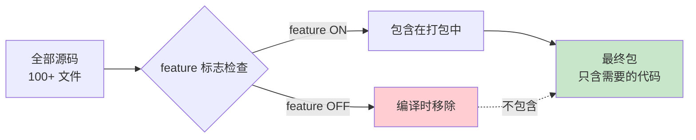
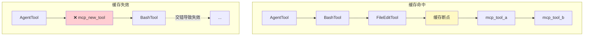
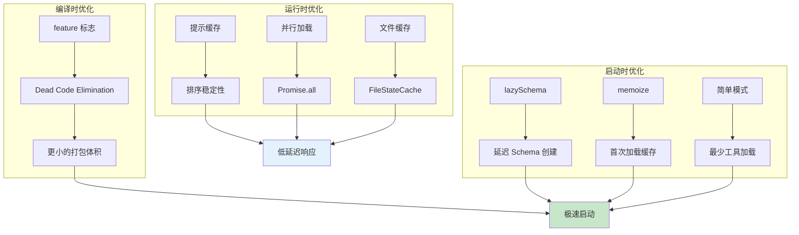

# 第四课：极速启动 —— 性能优化黑科技全解

> 🎯 对应漫画：第 4 张《极速启动》

---

## 学习目标

1. 理解 Claude Code 如何实现亚秒级启动
2. 掌握条件加载与 Dead Code Elimination 技术
3. 了解 `lazySchema` 和延迟初始化模式
4. 理解 Bun 运行时与 `bun:bundle` 特性标志系统
5. 学会提示缓存（Prompt Cache）的稳定性设计

---

## 一、生活类比：快餐店 vs 大酒店

**大酒店**的做法：开门前把所有菜都准备好，从鲍鱼到小笼包一应俱全。
→ 启动慢，但什么都有

**快餐店**的做法：先把最常点的几道准备好，客人点了特殊菜再现做。
→ 启动快，按需供应

Claude Code 就是"快餐店模式"——先加载核心功能立即可用，特殊功能按需加载。

---

## 二、特性标志：编译时剪枝

### 2.1 bun:bundle 特性标志

Claude Code 使用 Bun 运行时的特性标志系统，在**编译时**决定哪些代码要包含：

```typescript
// 源码：tools.ts — 特性标志导入
import { feature } from 'bun:bundle'

// 编译时决定：如果 PROACTIVE 特性关闭，整个 SleepTool 的代码都不会打包
const SleepTool =
  feature('PROACTIVE') || feature('KAIROS')
    ? require('./tools/SleepTool/SleepTool.js').SleepTool
    : null
```

### 2.2 Dead Code Elimination（死代码消除）



常见的特性标志：

| 标志 | 控制的功能 | 说明 |
|------|-----------|------|
| `COORDINATOR_MODE` | 协调者模式 | 多代理协同 |
| `PROACTIVE` | 主动行为 | AI 主动触发 |
| `KAIROS` | 助手模式 | 长会话模式 |
| `AGENT_TRIGGERS` | 代理触发器 | Cron 任务 |
| `TERMINAL_PANEL` | 终端面板 | 终端捕获 |
| `HISTORY_SNIP` | 历史裁剪 | 上下文管理 |
| `CONTEXT_COLLAPSE` | 上下文折叠 | 上下文优化 |
| `WEB_BROWSER_TOOL` | 网页浏览器 | 浏览器工具 |
| `OVERFLOW_TEST_TOOL` | 溢出测试 | 测试专用 |
| `WORKFLOW_SCRIPTS` | 工作流脚本 | 自动化流程 |

### 2.3 环境变量条件加载

除了编译时标志，还有运行时环境变量控制：

```typescript
// 源码：tools.ts
// 只有内部用户才有 ConfigTool 和 TungstenTool
...(process.env.USER_TYPE === 'ant' ? [ConfigTool] : []),
...(process.env.USER_TYPE === 'ant' ? [TungstenTool] : []),

// 测试环境才有的工具
...(process.env.NODE_ENV === 'test'
  ? [TestingPermissionTool] : []),
```

---

## 三、lazySchema：延迟模式定义

### 3.1 问题：Schema 定义的开销

每个工具都有 Zod Schema 定义输入参数。如果所有 Schema 在启动时就解析，会增加初始化时间。

### 3.2 解决方案：lazySchema

```typescript
// 源码：tools/AgentTool/AgentTool.tsx — lazySchema 使用
const baseInputSchema = lazySchema(() => z.object({
  description: z.string()
    .describe('A short (3-5 word) description of the task'),
  prompt: z.string()
    .describe('The task for the agent to perform'),
  subagent_type: z.string().optional()
    .describe('The type of specialized agent to use'),
  model: z.enum(['sonnet', 'opus', 'haiku']).optional(),
  run_in_background: z.boolean().optional()
}));
```

`lazySchema` 的原理很简单：

```typescript
// 概念代码
function lazySchema<T>(factory: () => T): () => T {
  let cached: T | null = null
  return () => {
    if (cached === null) {
      cached = factory()
    }
    return cached
  }
}
```

**首次调用**时才创建 Schema 对象，之后使用缓存。启动时零开销。

---

## 四、memoize：缓存计算结果

### 4.1 技能加载的缓存

加载技能文件涉及文件系统操作，用 `memoize` 缓存避免重复加载：

```typescript
// 源码：skills/loadSkillsDir.ts
import memoize from 'lodash-es/memoize.js'

export const getSkillDirCommands = memoize(
  async (cwd: string): Promise<Command[]> => {
    // 扫描技能目录、加载 SKILL.md 文件
    // 这个过程涉及大量 fs 操作
    // 用 memoize 后只执行一次
    const [managedSkills, userSkills, projectSkills, ...] =
      await Promise.all([...])

    return deduplicatedSkills
  }
)

// 需要清除缓存时
export function clearSkillCaches() {
  getSkillDirCommands.cache?.clear?.()
}
```

### 4.2 文件状态缓存

```typescript
// 概念：FileStateCache
// 读取文件后缓存内容和状态
// 避免同一文件在一次对话中被反复读取
```

---

## 五、提示缓存稳定性

### 5.1 问题：缓存失效

Claude API 支持提示缓存——相同的前缀可以复用之前的计算结果。但工具列表的顺序变化会导致缓存失效。

### 5.2 解决方案：排序分区

```typescript
// 源码：tools.ts — assembleToolPool
export function assembleToolPool(
  permissionContext: ToolPermissionContext,
  mcpTools: Tools,
): Tools {
  // 内置工具排在前面作为连续前缀
  // MCP 工具排在后面
  // 各自按名称排序
  const byName = (a: Tool, b: Tool) => a.name.localeCompare(b.name)
  return uniqBy(
    [...builtInTools].sort(byName)
      .concat(allowedMcpTools.sort(byName)),
    'name',
  )
}
```



**关键设计**：
- 内置工具永远排在前面 → 提示缓存前缀不变
- MCP 工具排在后面 → 新增 MCP 工具不影响内置工具的缓存
- `uniqBy` 保留插入顺序 → 内置工具同名优先

---

## 六、并行加载

### 6.1 技能并行发现

```typescript
// 源码：skills/loadSkillsDir.ts — 并行加载
const [
  managedSkills,
  userSkills,
  projectSkillsNested,
  additionalSkillsNested,
  legacyCommands,
] = await Promise.all([
  loadSkillsFromSkillsDir(managedSkillsDir, 'policySettings'),
  loadSkillsFromSkillsDir(userSkillsDir, 'userSettings'),
  Promise.all(
    projectSkillsDirs.map(dir =>
      loadSkillsFromSkillsDir(dir, 'projectSettings'))
  ),
  Promise.all(
    additionalDirs.map(dir =>
      loadSkillsFromSkillsDir(join(dir, '.claude', 'skills'), ...))
  ),
  loadSkillsFromCommandsDir(cwd),
])
```

五个目录的技能**同时加载**，而不是一个一个来。

### 6.2 文件身份去重

```typescript
// 源码：skills/loadSkillsDir.ts — 并行去重
const fileIds = await Promise.all(
  allSkillsWithPaths.map(({ skill, filePath }) =>
    skill.type === 'prompt'
      ? getFileIdentity(filePath)   // realpath 解析符号链接
      : Promise.resolve(null)
  )
)
```

通过 `realpath` 解析真实路径，识别通过不同路径（如符号链接）引用的同一文件。

---

## 七、条件工具加载

### 7.1 简单模式

```typescript
// 源码：tools.ts — 简单模式优化
if (isEnvTruthy(process.env.CLAUDE_CODE_SIMPLE)) {
  const simpleTools: Tool[] = [BashTool, FileReadTool, FileEditTool]
  return filterToolsByDenyRules(simpleTools, permissionContext)
}
```

简单模式只加载 3 个核心工具，启动极快。

### 7.2 REPL 模式过滤

```typescript
// 源码：tools.ts — REPL 模式
if (isReplModeEnabled()) {
  const replEnabled = allowedTools.some(
    tool => toolMatchesName(tool, REPL_TOOL_NAME)
  )
  if (replEnabled) {
    allowedTools = allowedTools.filter(
      tool => !REPL_ONLY_TOOLS.has(tool.name)
    )
  }
}
```

REPL 模式下，原始工具被隐藏（通过 REPL 间接使用），减少工具列表大小。

---

## 八、嵌入式搜索工具

```typescript
// 源码：tools.ts — 嵌入式搜索
...(hasEmbeddedSearchTools()
  ? []
  : [GlobTool, GrepTool]),
```

当 Bun 二进制中内嵌了 `bfs`/`ugrep` 时，不需要单独的 `GlobTool` 和 `GrepTool`——Bash 中的 `find`/`grep` 已经被别名到快速版本。减少两个工具的 Schema 开销。

---

## 九、性能优化全景图



---

## 十、动手练习

### 练习 1：分析启动路径

假设以下特性标志状态：
- `COORDINATOR_MODE` = ON
- `KAIROS` = OFF
- `AGENT_TRIGGERS` = OFF
- `WEB_BROWSER_TOOL` = OFF

请列出 `getAllBaseTools()` 会返回哪些工具（大致列举即可）。

### 练习 2：设计缓存策略

假设你在写一个 CLI 工具，需要在启动时：
1. 读取配置文件（~10ms）
2. 扫描项目目录结构（~50ms）
3. 解析 10 个插件的 Schema（~5ms/个）
4. 建立网络连接（~200ms）

如何用本课学到的技术优化启动时间？画出优化方案。

### 思考题

1. `feature()` 在编译时就确定了，但 `process.env` 是运行时检查——这两种方式各有什么优劣？
2. `lazySchema` 的首次调用会有微小延迟，这可以接受吗？为什么？
3. 提示缓存为什么要把内置工具和 MCP 工具分开排序？

---

## 十一、本课小结

| 知识点 | 核心内容 |
|--------|----------|
| 特性标志 | `bun:bundle` 编译时决定代码包含 |
| Dead Code Elimination | 未启用的功能编译时移除 |
| lazySchema | 延迟创建 Schema，启动零开销 |
| memoize | 缓存函数结果，避免重复计算 |
| 提示缓存稳定性 | 工具排序分区，内置优先 |
| 并行加载 | `Promise.all` 同时加载多个来源 |
| 简单模式 | 最少工具加载，极速启动 |

**一句话总结**：Claude Code 的性能优化是一个**从编译到运行的全链路工程**——编译时用特性标志剪掉不需要的代码，启动时用懒加载和缓存减少初始化开销，运行时用排序和并行保证低延迟。

---

## 下节预告

> **第五课：记忆压缩术 —— 四层上下文管理详解**
>
> AI 对话越长，上下文越大，token 越多，费用越高。Claude Code 如何在
> 保留关键信息的同时压缩上下文？下节课揭秘 compact 机制的四层压缩架构！
