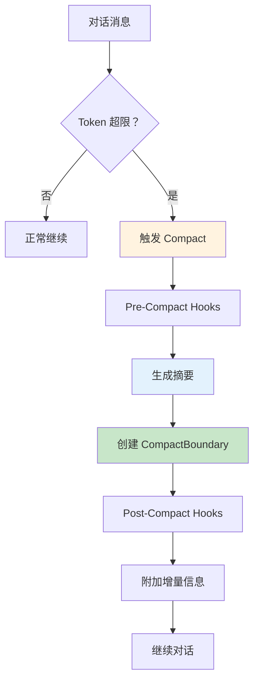
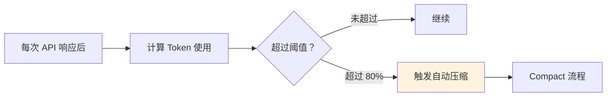
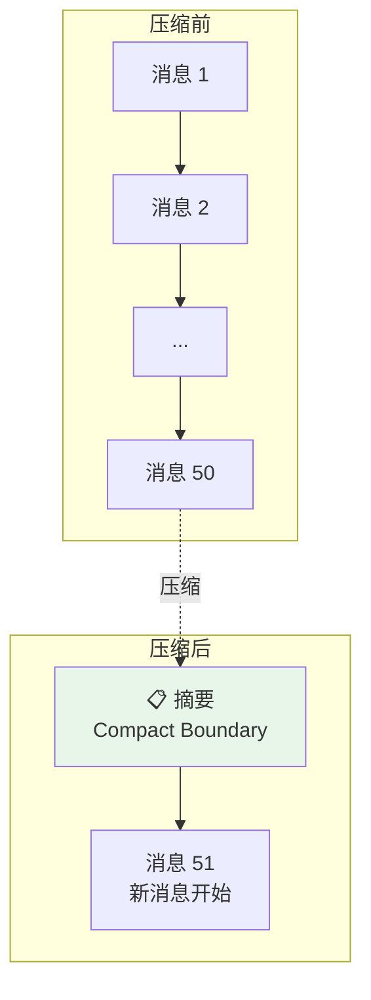
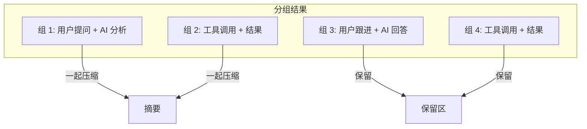
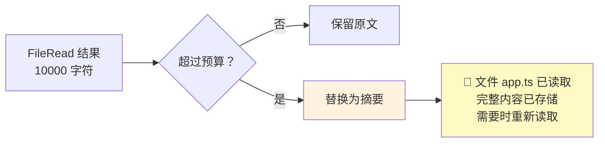
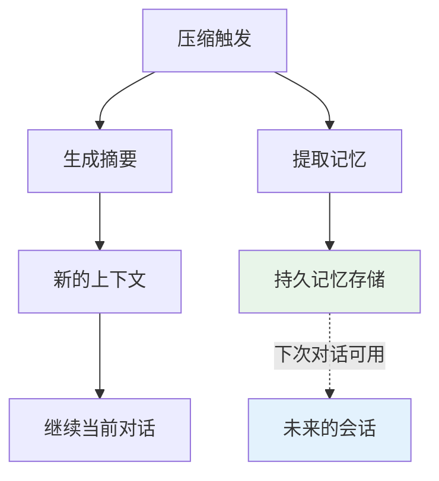
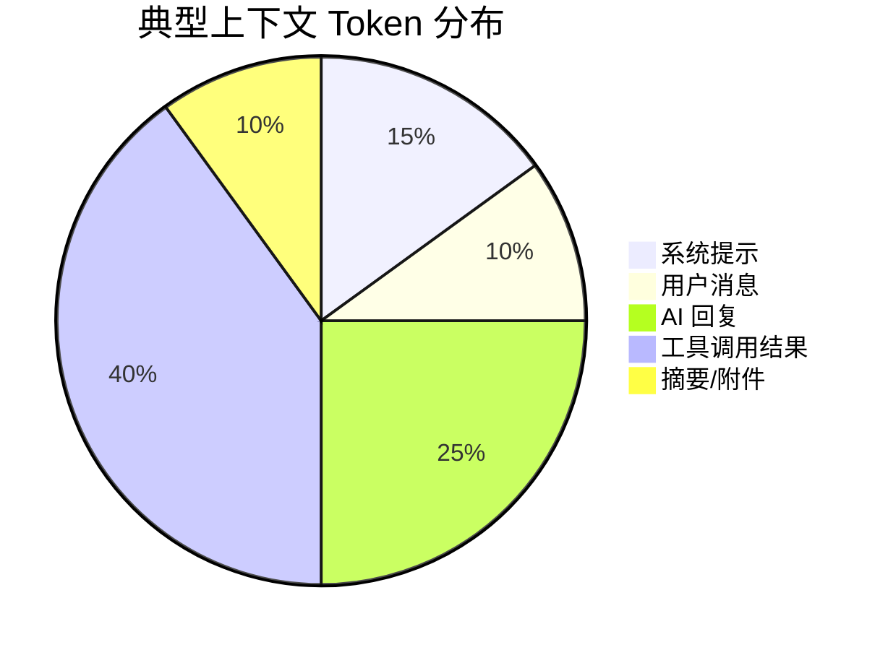

# 第五课：记忆压缩术 —— 四层上下文管理详解

> 🎯 对应漫画：第 5 张《记忆压缩术》

---

## 学习目标

1. 理解 AI 对话中上下文窗口的挑战与限制
2. 掌握 Claude Code 的 Compact 压缩机制核心流程
3. 了解自动压缩触发的条件与策略
4. 理解压缩边界（Compact Boundary）的设计
5. 学会工具结果存储与替换的优化策略

---

## 一、生活类比：图书馆的书架管理

你的书架（上下文窗口）只能放 200 本书：

- **第 1 层**：书架满了 → 把读完的书**写个摘要**放在最前面，原书归档（Compact）
- **第 2 层**：摘要太多了 → 把多个摘要**合并成一个大摘要**（递归压缩）
- **第 3 层**：有些书太厚 → 只保留**目录和重点章节**（工具结果裁剪）
- **第 4 层**：急用时 → 直接查**索引卡片**找到关键信息（微压缩）

Claude Code 的上下文管理就是这四层"书架管理术"。

---

## 二、Compact 系统核心：compact.ts

### 2.1 系统架构



### 2.2 核心依赖

```typescript
// 源码：services/compact/compact.ts — 导入
import {
  createCompactBoundaryMessage,
  getMessagesAfterCompactBoundary,
  isCompactBoundaryMessage,
  normalizeMessagesForAPI,
} from '../../utils/messages.js'

import {
  executePostCompactHooks,
  executePreCompactHooks,
} from '../../utils/hooks.js'

import {
  getTokenUsage,
  tokenCountFromLastAPIResponse,
  tokenCountWithEstimation,
} from '../../utils/tokens.js'
```

### 2.3 Compact 提示词

压缩时使用专门的提示词引导 AI 生成摘要：

```typescript
// 源码：services/compact/prompt.ts（概念）
// 指导 AI 生成高质量摘要的系统提示
// 要求保留：
// - 当前任务目标
// - 已完成的操作
// - 关键发现和决策
// - 待完成的事项
// - 文件路径和行号
```

---

## 三、自动压缩触发器

### 3.1 autoCompact

```typescript
// 源码：services/compact/autoCompact.ts（概念）
// 监控当前上下文的 token 使用量
// 当接近上下文窗口限制时自动触发压缩
```



### 3.2 压缩警告状态

```typescript
// 源码：services/compact/compactWarningState.ts（概念）
// 追踪上下文使用百分比
// 在 UI 上显示警告指示器
// 类似手机电量：80% 提醒、90% 警告、95% 紧急
```

| 使用率 | 状态 | 行为 |
|--------|------|------|
| < 70% | 安全 | 正常工作 |
| 70-85% | 提醒 | UI 显示使用率 |
| 85-95% | 警告 | 建议压缩 |
| > 95% | 紧急 | 自动触发压缩 |

---

## 四、Compact Boundary：压缩边界

### 4.1 什么是 Compact Boundary？

压缩后，旧消息和新摘要之间有一个**边界标记**：

```typescript
// 概念：CompactBoundary 消息
type SystemCompactBoundaryMessage = {
  type: 'system'
  subtype: 'compact_boundary'
  summary: string        // 压缩后的摘要
  originalCount: number  // 被压缩的消息数量
}
```



### 4.2 增量信息附加

压缩后，某些上下文需要重新注入（因为摘要可能遗漏）：

```typescript
// 源码：services/compact/compact.ts — 增量附加
import {
  getAgentListingDeltaAttachment,
  getDeferredToolsDeltaAttachment,
  getMcpInstructionsDeltaAttachment,
} from '../../utils/attachments.js'
```

| 增量类型 | 内容 | 作用 |
|----------|------|------|
| Agent Listing | 代理列表变化 | 知道有哪些子代理 |
| Deferred Tools | 延迟加载的工具 | 知道有哪些工具可用 |
| MCP Instructions | MCP 服务器指令 | 保持 MCP 连接上下文 |

---

## 五、分组策略

### 5.1 消息分组

```typescript
// 源码：services/compact/grouping.ts（概念）
// 将连续的相关消息分组
// 同一个工具调用的请求和响应不被拆开
// 确保压缩时不丢失关联性
```



### 5.2 部分压缩

不是所有消息都需要压缩——最近的消息通常保留：

```typescript
// 概念：部分压缩方向
type PartialCompactDirection = 'oldest' | 'newest'
// oldest: 只压缩最老的消息（默认）
// newest: 特殊场景
```

---

## 六、微压缩：apiMicrocompact

### 6.1 紧急场景

当上下文已经压缩过但还是太大时，需要更激进的"微压缩"：

```typescript
// 源码：services/compact/apiMicrocompact.ts（概念）
// 微压缩：在 API 调用级别直接裁剪
// 不走完整的压缩流程
// 而是直接截断或替换最大的工具结果
```

### 6.2 工具结果替换

大型工具输出（如读取一个很长的文件）可以被替换为引用：

```typescript
// 概念：ContentReplacementState
// 追踪哪些工具结果被替换了
// 替换后保留引用信息
// 需要时可以通过 FileRead 重新获取
```



---

## 七、Session Memory Compact

### 7.1 会话记忆提取

压缩时还会触发**记忆提取**——把对话中的重要信息保存为持久记忆：

```typescript
// 源码：services/compact/sessionMemoryCompact.ts（概念）
// 在压缩过程中：
// 1. 分析被压缩的消息
// 2. 提取值得记忆的信息
// 3. 保存到记忆系统
// 这样即使压缩丢失了细节，记忆系统仍然保留
```

### 7.2 压缩与记忆的协同



---

## 八、Hooks 系统集成

### 8.1 Pre-Compact Hooks

压缩前可以执行自定义钩子：

```typescript
// 概念：压缩前钩子
// - 保存当前工作状态
// - 导出重要上下文
// - 触发自定义处理
```

### 8.2 Post-Compact Hooks

压缩后可以执行自定义钩子：

```typescript
// 概念：压缩后钩子
// - 重新注入必要上下文
// - 更新状态
// - 记录压缩事件

// 压缩进度事件
export type CompactProgressEvent =
  | { type: 'hooks_start', hookType: 'pre_compact' | 'post_compact' }
  | { type: 'compact_start' }
  | { type: 'compact_end' }
```

---

## 九、Token 管理策略

### 9.1 Token 使用追踪

```typescript
// 源码引用
import {
  getTokenUsage,
  tokenCountFromLastAPIResponse,
  tokenCountWithEstimation,
} from '../../utils/tokens.js'
```

### 9.2 输出 Token 限制

```typescript
// 源码：services/compact/compact.ts
import { COMPACT_MAX_OUTPUT_TOKENS } from '../../utils/context.js'
// 压缩摘要的 token 上限
// 防止摘要比原文还长
```

### 9.3 上下文分析

```typescript
// 概念：contextAnalysis
import {
  analyzeContext,
  tokenStatsToStatsigMetrics,
} from '../../utils/contextAnalysis.js'
// 分析上下文组成：系统提示、用户消息、工具结果各占多少
// 用于决定压缩策略
```



工具调用结果通常是最大的 token 消耗者——这就是为什么工具结果替换是最有效的压缩手段。

---

## 十、动手练习

### 练习 1：模拟压缩决策

假设上下文窗口为 100K token，当前使用 92K：

| 消息 | Token 数 | 重要性 |
|------|----------|--------|
| 系统提示 | 5K | 不可压缩 |
| 用户需求描述 | 2K | 高 |
| 文件读取结果 (app.ts) | 8K | 中 |
| 文件读取结果 (config.ts) | 15K | 低 |
| AI 分析 | 5K | 高 |
| Bash 输出 (npm test) | 20K | 中 |
| 文件编辑记录 | 7K | 高 |
| 最近 3 轮对话 | 30K | 高 |

设计你的压缩策略：哪些压缩？哪些保留？摘要应该包含什么？

### 练习 2：设计压缩提示词

为 Compact 系统写一个压缩提示词（中文），要求 AI 在生成摘要时：
- 保留文件路径和行号
- 保留用户的原始需求
- 保留已执行的关键操作
- 忽略格式化输出和调试信息

### 思考题

1. 为什么压缩后还要附加增量信息？直接写进摘要不行吗？
2. 微压缩和完整压缩相比有什么优缺点？
3. 为什么工具结果可以被替换为引用，但用户消息不能？

---

## 十一、本课小结

| 知识点 | 核心内容 |
|--------|----------|
| Compact 机制 | 对话过长时生成摘要替代旧消息 |
| 自动触发 | 监控 token 使用率，超阈值自动压缩 |
| Compact Boundary | 标记压缩边界，分隔摘要和新消息 |
| 分组压缩 | 关联消息一起处理，不拆开工具调用对 |
| 微压缩 | API 级别的紧急裁剪 |
| 工具结果替换 | 大型输出替换为引用 |
| 记忆提取 | 压缩时同步提取持久记忆 |

**一句话总结**：Claude Code 的上下文管理就像一个**智能图书管理员**——它知道哪些书已经读完可以写摘要，哪些正在看需要保留，哪些内容值得记到笔记本里以后用。

---

## 下节预告

> **第六课：终端魔法屏 —— React+Ink 终端 UI 解析**
>
> 你有没有好奇过，Claude Code 的终端界面为什么这么好看？彩色文本、进度条、
> 滚动面板……这些都是用 React 做的？下节课揭秘终端 UI 的黑科技！
