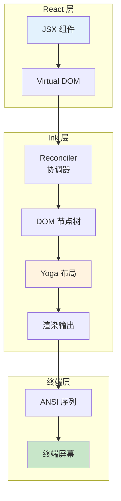
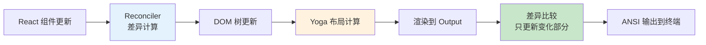
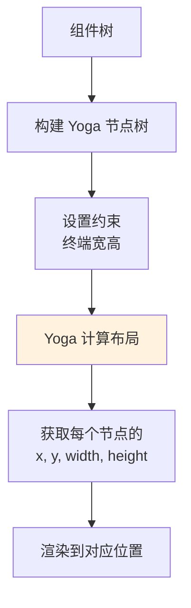
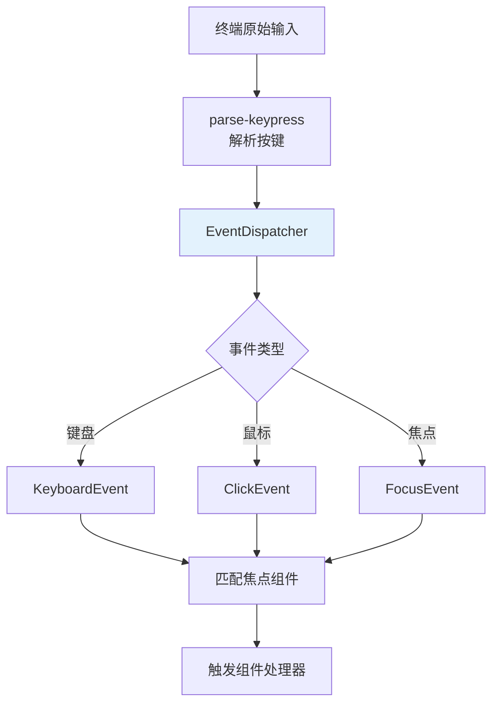
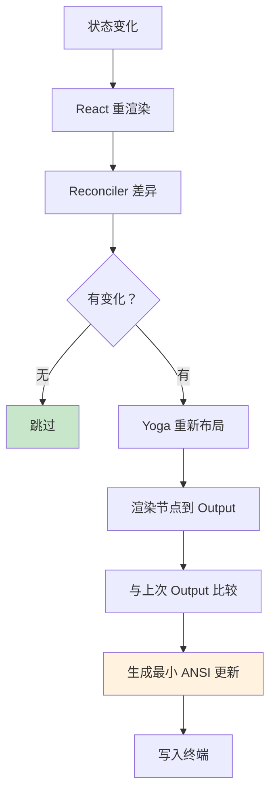

# 第六课：终端魔法屏 —— React+Ink 终端 UI 解析

> 🎯 对应漫画：第 6 张《终端魔法屏》

---

## 学习目标

1. 理解为什么 Claude Code 选择 React+Ink 构建终端 UI
2. 掌握 Ink 框架的核心概念：组件、布局、渲染
3. 了解 Claude Code 的 UI 组件库架构
4. 理解终端事件处理系统（键盘、鼠标、焦点）
5. 学会 Yoga 布局引擎在终端中的应用

---

## 一、生活类比：在画布上作画

传统终端程序就像**用打字机写信**——只能一行一行输出文字，改一个字就得重新打一页。

Claude Code 的终端 UI 就像**在电子画布上作画**——你可以随时在任何位置画、擦、改，
还能放上按钮、滚动条、进度条，就像一个真正的图形界面。

实现这个"魔法"的技术栈：**React（声明式 UI）+ Ink（终端渲染器）+ Yoga（弹性布局）**。

---

## 二、技术架构总览



---

## 三、Ink 核心模块

### 3.1 自定义 Reconciler

Claude Code 深度定制了 Ink 的 React Reconciler（协调器）：

```typescript
// 源码：ink/reconciler.ts（概念）
// 自定义 React Reconciler
// 将 React 虚拟 DOM 映射到终端节点
// 不同于浏览器 DOM，这里的"节点"是终端文本块
```

### 3.2 DOM 节点

```typescript
// 源码：ink/dom.ts（概念）
// 终端 DOM 节点
// 每个节点有：位置、大小、样式、子节点
// 类似浏览器 DOM，但输出是 ANSI 文本
```

### 3.3 渲染管线



---

## 四、核心组件库

### 4.1 基础组件

Claude Code 的 Ink 层提供了丰富的基础组件：

```typescript
// 源码：ink/components/ 目录
// Box.tsx      — 弹性盒子布局（类似 CSS Flexbox）
// Text.tsx     — 文本渲染（颜色、粗体、下划线）
// ScrollBox.tsx — 可滚动容器
// Button.tsx   — 可点击按钮
// Link.tsx     — 超链接
// Spacer.tsx   — 间距占位
// Newline.tsx  — 换行
```

### 4.2 Box 组件：终端中的 Flexbox

```tsx
// 源码：ink/components/Box.tsx（概念用法）
<Box flexDirection="column" padding={1} borderStyle="round">
  <Box flexDirection="row" justifyContent="space-between">
    <Text bold color="green">Claude Code</Text>
    <Text dimColor>v1.0.0</Text>
  </Box>
  <Box marginTop={1}>
    <Text>正在分析代码...</Text>
  </Box>
</Box>
```

终端中渲染效果：
```
╭──────────────────────────────────╮
│ Claude Code              v1.0.0 │
│                                  │
│ 正在分析代码...                  │
╰──────────────────────────────────╯
```

### 4.3 ScrollBox 组件

```typescript
// 源码：ink/components/ScrollBox.tsx（概念）
// 实现终端中的可滚动区域
// 支持键盘上下键滚动
// 支持鼠标滚轮
// 自动计算可视区域
```

---

## 五、Yoga 布局引擎

### 5.1 什么是 Yoga？

Yoga 是 Facebook 开发的跨平台弹性布局引擎（CSS Flexbox 的 C 实现），Claude Code 用它在终端中实现复杂布局。

```typescript
// 源码：ink/layout/yoga.ts — Yoga 集成
// 将终端的行列坐标映射到 Yoga 的布局系统
// 支持：flexDirection, justifyContent, alignItems, padding, margin 等
```

### 5.2 布局计算流程



```typescript
// 源码：ink/layout/engine.ts（概念）
// 布局引擎
// 输入：组件树 + 终端尺寸
// 输出：每个组件的精确位置和大小
```

```typescript
// 源码：ink/layout/geometry.ts（概念）
// 几何计算
// 处理文本换行、边框占位、内边距等
```

---

## 六、事件处理系统

### 6.1 键盘输入

```typescript
// 源码：ink/parse-keypress.ts
// 解析终端原始输入为结构化按键事件
// 支持：普通字符、特殊键（Enter/Esc/Tab）
// 支持：组合键（Ctrl+C, Cmd+V）
// 支持：方向键、功能键
```

### 6.2 事件分发

```typescript
// 源码：ink/events/ 目录
// emitter.ts          — 事件发射器
// dispatcher.ts       — 事件分发器
// keyboard-event.ts   — 键盘事件
// click-event.ts      — 点击事件
// focus-event.ts      — 焦点事件
// input-event.ts      — 输入事件
```



### 6.3 焦点管理

```typescript
// 源码：ink/focus.ts
// 终端中的焦点管理
// Tab 键切换焦点
// 自动焦点到输入框
// 焦点可视化（高亮边框等）
```

---

## 七、Hooks 系统

Claude Code 的 Ink 层提供了丰富的 React Hooks：

### 7.1 核心 Hooks

```typescript
// 源码：ink/hooks/ 目录

// use-input.ts — 监听键盘输入
useInput((input, key) => {
  if (key.return) handleSubmit()
  if (key.escape) handleCancel()
})

// use-terminal-viewport.ts — 获取终端尺寸
const { columns, rows } = useTerminalViewport()

// use-stdin.ts — 原始标准输入
const { stdin, setRawMode } = useStdin()

// use-selection.ts — 文本选择
const { selectedText } = useSelection()

// use-terminal-focus.ts — 终端窗口焦点状态
const isFocused = useTerminalFocus()
```

### 7.2 动画 Hook

```typescript
// 源码：ink/hooks/use-animation-frame.ts
// 类似浏览器的 requestAnimationFrame
// 用于 Spinner、进度条等动画效果
useAnimationFrame(() => {
  // 每帧更新动画状态
  setFrame(prev => prev + 1)
})
```

---

## 八、应用层组件

### 8.1 App 组件

```typescript
// 源码：ink/components/App.tsx
// 顶层应用组件
// 包含：上下文提供者、全局状态、错误边界
```

### 8.2 Claude Code 的业务组件

```typescript
// 源码：components/ 目录（部分列举）
// App.tsx                    — 主应用
// CompactSummary.tsx         — 压缩摘要显示
// ContextVisualization.tsx   — 上下文可视化
// CoordinatorAgentStatus.tsx — 协调者代理状态
// Spinner.tsx                — 加载动画
// PermissionDialog.tsx       — 权限确认弹窗
// DiagnosticsDisplay.tsx     — 诊断信息
```

### 8.3 终端尺寸上下文

```tsx
// 源码：ink/components/TerminalSizeContext.tsx
// 提供终端尺寸信息
// 组件可以根据终端大小自适应布局
```

---

## 九、渲染优化

### 9.1 差异渲染

```typescript
// 源码：ink/output.ts（概念）
// 不是每次都清屏重绘
// 而是计算本次渲染和上次的差异
// 只更新变化的部分 → 减少闪烁
```

### 9.2 节点缓存

```typescript
// 源码：ink/node-cache.ts
// 缓存 DOM 节点的渲染结果
// 未变化的节点跳过重新渲染
```

### 9.3 文本宽度计算

```typescript
// 源码：ink/stringWidth.ts
// 精确计算字符串显示宽度
// 处理：CJK 字符（宽度 2）、emoji、ANSI 转义序列
// 确保布局在各种字符集下都正确
```

```typescript
// 源码：ink/wrapAnsi.ts
// ANSI 感知的文本换行
// 换行时保持颜色和样式的连续性
```

### 9.4 渲染流程



---

## 十、ANSI 渲染细节

### 10.1 颜色与样式

```typescript
// 源码：ink/colorize.ts
// 将样式属性转换为 ANSI 转义序列
// 支持：256 色、RGB 真彩色
// 支持：粗体、斜体、下划线、删除线
```

### 10.2 边框渲染

```typescript
// 源码：ink/render-border.ts
// 使用 Unicode 字符绘制边框
// 支持样式：single, double, round, bold, classic
// ╭──╮  ┌──┐  ╔══╗
// │  │  │  │  ║  ║
// ╰──╯  └──┘  ╚══╝
```

### 10.3 超链接

```typescript
// 源码：ink/supports-hyperlinks.ts
// 检测终端是否支持 OSC 8 超链接
// 支持的终端中可以点击打开链接
```

---

## 十一、动手练习

### 练习 1：理解组件组合

用伪 JSX 描述以下终端 UI 的组件结构：

```
╭─ Claude Code ──────────────────╮
│ > 正在分析 src/app.ts...       │
│   ████████░░░░ 65%             │
│                                │
│ 发现 3 个问题：                │
│   1. 未使用的导入              │
│   2. 类型不匹配                │
│   3. 缺少错误处理              │
│                                │
│ [修复全部]  [跳过]  [查看详情] │
╰────────────────────────────────╯
```

### 练习 2：设计事件处理

为一个简单的文件选择器设计键盘事件处理：
- 上下键选择文件
- Enter 确认选择
- Esc 取消
- 输入字符筛选文件名

### 思考题

1. 为什么选择 React 而不是直接操作终端？
2. Yoga 布局引擎和 CSS Flexbox 有什么关系？
3. 差异渲染相比全量重绘有什么优势？有什么局限？

---

## 十二、本课小结

| 知识点 | 核心内容 |
|--------|----------|
| 技术栈 | React + Ink + Yoga，声明式终端 UI |
| Reconciler | 将 React 虚拟 DOM 映射到终端节点 |
| Yoga 布局 | CSS Flexbox 在终端中的实现 |
| 事件系统 | 键盘、鼠标、焦点的统一处理 |
| 组件库 | Box/Text/ScrollBox/Button 等丰富组件 |
| 渲染优化 | 差异渲染、节点缓存、最小 ANSI 更新 |
| 文本处理 | CJK 宽度、ANSI 感知换行、边框绘制 |

**一句话总结**：Claude Code 把**浏览器级别的 UI 开发体验**搬到了终端——用 React 写组件、用 Flexbox 做布局、用差异渲染保证性能，终端再也不只是黑白字符。

---

## 下节预告

> **第七课：永不遗忘 —— 自动记忆系统原理**
>
> 每次开新对话，Claude Code 怎么还记得你上次说的话？
> 下节课揭秘 memdir 记忆系统——文件化、结构化、自动化的持久记忆！
