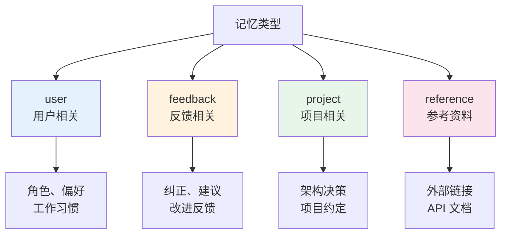
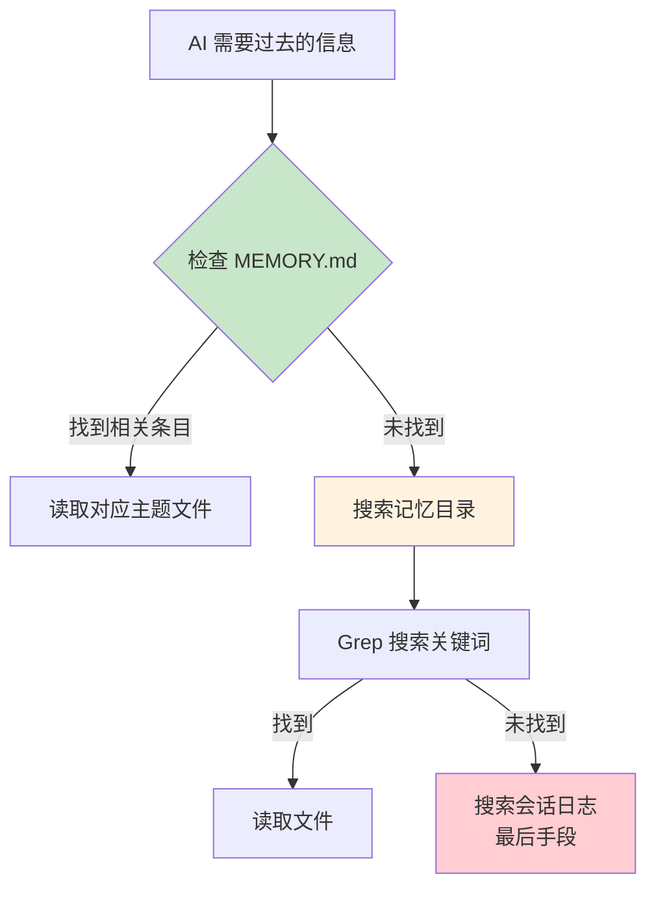
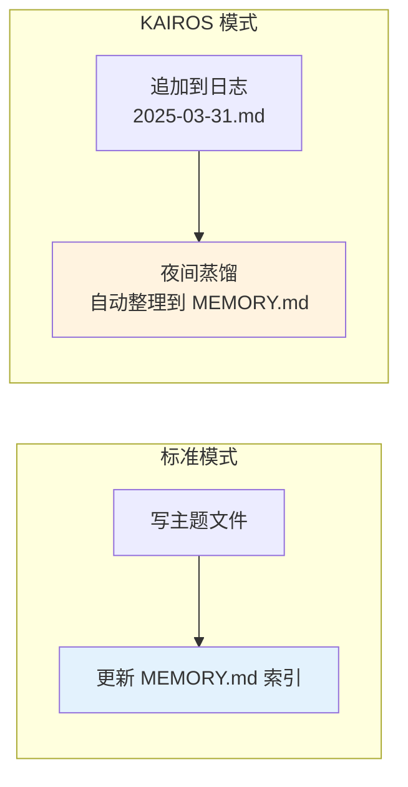

# 第七课：永不遗忘 —— 自动记忆系统原理

> 🎯 对应漫画：第 7 张《永不遗忘》

---

## 学习目标

1. 理解 Claude Code 记忆系统的整体架构
2. 掌握 MEMORY.md 索引文件与主题文件的关系
3. 了解四种记忆类型的分类法则
4. 理解记忆的自动保存、搜索与召回机制
5. 学会记忆系统与上下文压缩的协同工作

---

## 一、生活类比：你的个人笔记系统

想象你有一个完美的笔记系统：

- **索引卡片**（MEMORY.md）—— 一张目录卡，列出所有笔记本的位置
- **主题笔记本**（topic files）—— 按主题分类的详细笔记
- **自动速记员**—— 帮你把重要对话自动记到笔记里
- **搜索引擎**—— 需要时快速找到相关笔记

Claude Code 的记忆系统就是这样一个**文件化、结构化、自动化**的笔记系统。

---

## 二、记忆目录结构

### 2.1 存储位置

```typescript
// 源码：memdir/paths.ts（概念）
// 记忆文件存储在：~/.claude/projects/<project-slug>/memory/
// 每个项目有自己的记忆目录
```

```
~/.claude/projects/my-project/memory/
├── MEMORY.md              ← 索引文件（始终加载到上下文）
├── user_preferences.md    ← 用户偏好
├── project_structure.md   ← 项目架构
├── feedback_testing.md    ← 测试反馈
├── coding_standards.md    ← 编码标准
└── team/                  ← 团队共享记忆（可选）
    ├── MEMORY.md
    └── team_conventions.md
```

### 2.2 MEMORY.md 索引文件

```typescript
// 源码：memdir/memdir.ts
export const ENTRYPOINT_NAME = 'MEMORY.md'
export const MAX_ENTRYPOINT_LINES = 200
export const MAX_ENTRYPOINT_BYTES = 25_000
```

MEMORY.md 是一个**索引**，不是记忆内容本身：

```markdown
<!-- MEMORY.md 示例 -->
- [用户角色](user_role.md) — 全栈工程师，偏好 TypeScript
- [测试偏好](feedback_testing.md) — 喜欢 Vitest，不用 Jest
- [Git 习惯](git_workflow.md) — conventional commits 风格
- [项目架构](project_structure.md) — monorepo，pnpm workspace
```

### 2.3 索引截断保护

索引文件太大时会被截断，并附加警告：

```typescript
// 源码：memdir/memdir.ts — truncateEntrypointContent
export function truncateEntrypointContent(raw: string): EntrypointTruncation {
  const contentLines = trimmed.split('\n')
  const wasLineTruncated = lineCount > MAX_ENTRYPOINT_LINES
  const wasByteTruncated = byteCount > MAX_ENTRYPOINT_BYTES

  if (truncated.length > MAX_ENTRYPOINT_BYTES) {
    const cutAt = truncated.lastIndexOf('\n', MAX_ENTRYPOINT_BYTES)
    truncated = truncated.slice(0, cutAt > 0 ? cutAt : MAX_ENTRYPOINT_BYTES)
  }

  return {
    content: truncated +
      `\n\n> WARNING: ${ENTRYPOINT_NAME} is ${reason}.
      Only part of it was loaded.
      Keep index entries to one line under ~200 chars;
      move detail into topic files.`,
    // ...
  }
}
```

---

## 三、四种记忆类型

### 3.1 类型分类法

```typescript
// 源码：memdir/memoryTypes.ts（概念）
// 记忆被严格分类为四种类型
export const MEMORY_TYPE_VALUES = [
  'user',       // 用户相关
  'feedback',   // 反馈相关
  'project',    // 项目相关
  'reference',  // 参考资料
] as const
```

### 3.2 各类型详解



| 类型 | 适合保存 | 不适合保存 |
|------|----------|------------|
| `user` | "我是前端工程师"、"用 vim 键位" | 临时偏好 |
| `feedback` | "不要自动运行 npm install"、"commit 消息用英文" | 一次性指示 |
| `project` | "数据库用 PostgreSQL"、"部署在 AWS" | 代码中可推断的信息 |
| `reference` | "设计文档在 Notion"、"CI/CD 用 GitHub Actions" | 完整文档内容 |

### 3.3 什么不应该保存为记忆？

```typescript
// 源码：memdir/memdir.ts — WHAT_NOT_TO_SAVE_SECTION
// 明确排除的内容：
// - 可从代码推导的信息（代码模式、架构、git 历史）
// - 当前对话中的临时上下文
// - 完整的文档或代码片段
```

---

## 四、记忆文件格式

每个记忆文件使用 YAML frontmatter + Markdown 内容：

```typescript
// 源码：memdir/memdir.ts — MEMORY_FRONTMATTER_EXAMPLE
```

```markdown
---
name: 用户编码偏好
type: feedback
description: 用户对代码风格的偏好设置
---

## 编码偏好

- 使用 TypeScript strict 模式
- 函数优先于类
- 使用 `const` 和箭头函数
- 错误处理使用 Result 模式而非 try-catch
```

---

## 五、记忆的保存流程

### 5.1 两步保存法

```typescript
// 源码：memdir/memdir.ts — buildMemoryLines 中的说明
// 保存记忆是两步过程：
// Step 1 — 写记忆到独立文件（如 user_role.md）
// Step 2 — 在 MEMORY.md 中添加索引指针
```


### 5.2 目录自动创建

```typescript
// 源码：memdir/memdir.ts — ensureMemoryDirExists
export async function ensureMemoryDirExists(memoryDir: string): Promise<void> {
  const fs = getFsImplementation()
  try {
    await fs.mkdir(memoryDir)
  } catch (e) {
    // fs.mkdir 已经处理 EEXIST
    // 只记录真正的权限错误
  }
}
```

系统提示中会告诉 AI：**"目录已经存在——直接用 Write 工具写入，不要先 mkdir"**

```typescript
// 源码：memdir/memdir.ts
export const DIR_EXISTS_GUIDANCE =
  'This directory already exists — write to it directly with the Write tool
  (do not run mkdir or check for its existence).'
```

---

## 六、记忆的加载与注入

### 6.1 加载时机

```typescript
// 源码：memdir/memdir.ts — loadMemoryPrompt
export async function loadMemoryPrompt(): Promise<string | null> {
  const autoEnabled = isAutoMemoryEnabled()

  // KAIROS 模式：使用日志式记忆
  if (feature('KAIROS') && autoEnabled && getKairosActive()) {
    return buildAssistantDailyLogPrompt(skipIndex)
  }

  // 团队记忆模式
  if (feature('TEAMMEM') && teamMemPaths.isTeamMemoryEnabled()) {
    return teamMemPrompts.buildCombinedMemoryPrompt(...)
  }

  // 标准模式
  if (autoEnabled) {
    await ensureMemoryDirExists(autoDir)
    return buildMemoryLines('auto memory', autoDir, ...).join('\n')
  }

  return null  // 记忆系统未启用
}
```

### 6.2 记忆提示注入

```typescript
// 源码：memdir/memdir.ts — buildMemoryLines
export function buildMemoryLines(
  displayName: string,
  memoryDir: string,
): string[] {
  return [
    `# ${displayName}`,
    '',
    `You have a persistent, file-based memory system at \`${memoryDir}\`.`,
    '',
    'You should build up this memory system over time...',
    '',
    // 类型说明
    // 何时保存
    // 何时访问
    // 如何搜索
    // MEMORY.md 内容
  ]
}
```

---

## 七、记忆搜索与召回

### 7.1 搜索过去的上下文

```typescript
// 源码：memdir/memdir.ts — buildSearchingPastContextSection
export function buildSearchingPastContextSection(autoMemDir: string): string[] {
  return [
    '## Searching past context',
    '',
    'When looking for past context:',
    '1. Search topic files in your memory directory:',
    '```',
    `Grep with pattern="<search term>" path="${autoMemDir}" glob="*.md"`,
    '```',
    '2. Session transcript logs (last resort — large files, slow):',
    '```',
    `Grep with pattern="<search term>" path="${projectDir}/" glob="*.jsonl"`,
    '```',
    'Use narrow search terms rather than broad keywords.',
  ]
}
```

### 7.2 找到相关记忆

```typescript
// 源码：memdir/findRelevantMemories.ts（概念）
// 根据当前对话上下文
// 搜索记忆目录中的相关文件
// 返回最相关的记忆供 AI 参考
```

### 7.3 搜索策略



---

## 八、团队记忆

### 8.1 个人 vs 团队

```typescript
// 源码：memdir/teamMemPaths.ts（概念）
// 团队记忆存储在个人记忆目录下的 team/ 子目录
// 可以通过同步机制在团队成员间共享
```

| 维度 | 个人记忆 | 团队记忆 |
|------|----------|----------|
| 位置 | `memory/` | `memory/team/` |
| 范围 | 只有自己可见 | 团队成员共享 |
| 内容 | 个人偏好、习惯 | 团队约定、规范 |
| 同步 | 不同步 | 自动同步 |

### 8.2 团队记忆同步

```typescript
// 源码：services/teamMemorySync（概念）
// 团队记忆通过后台服务同步
// 支持增量同步，减少网络开销
```

---

## 九、KAIROS 模式：日志式记忆

### 9.1 长会话模式

在 KAIROS（助手）模式下，会话可能持续数天。记忆不再使用传统的索引方式，而是**日志式追加**：

```typescript
// 源码：memdir/memdir.ts — buildAssistantDailyLogPrompt
function buildAssistantDailyLogPrompt(): string {
  const logPathPattern = join(
    memoryDir, 'logs', 'YYYY', 'MM', 'YYYY-MM-DD.md'
  )

  return [
    '# auto memory',
    '',
    'This session is long-lived. Record anything worth remembering',
    'by **appending** to today\'s daily log file:',
    '',
    `\`${logPathPattern}\``,
    '',
    'Write each entry as a short timestamped bullet.',
    'A separate nightly process distills these logs into MEMORY.md.',
  ].join('\n')
}
```

### 9.2 日志 vs 索引



---

## 十、记忆系统的信任与安全

### 10.1 信任召回的内容

```typescript
// 源码：memdir/memdir.ts — TRUSTING_RECALL_SECTION
// 指导 AI 如何对待召回的记忆：
// - 记忆可能过时 → 需要验证
// - 记忆可能不完整 → 需要补充
// - 记忆可能有冲突 → 需要取最新
```

### 10.2 何时访问记忆

```typescript
// 源码：memdir/memdir.ts — WHEN_TO_ACCESS_SECTION
// AI 应该在以下时机检查记忆：
// - 会话开始时（了解用户和项目背景）
// - 做决策时（检查是否有相关历史偏好）
// - 用户提到过去的事情时（搜索相关记忆）
// - 遇到不确定的情况时（检查是否有参考）
```

---

## 十一、动手练习

### 练习 1：设计记忆结构

为一个电商项目设计记忆系统的初始结构：
1. MEMORY.md 索引应该包含哪些条目？
2. 哪些信息适合用 `user` 类型保存？
3. 哪些信息适合用 `project` 类型保存？
4. 有什么信息**不应该**保存为记忆？

### 练习 2：记忆搜索练习

假设 MEMORY.md 索引如下：
```
- [数据库配置](db_config.md) — PostgreSQL, read replicas
- [部署流程](deployment.md) — AWS ECS, blue-green
- [测试策略](testing.md) — Vitest unit, Playwright e2e
- [代码审查](code_review.md) — PR 需要 2 人 approve
```

用户问："我们的 CI/CD 流程是什么？"

你作为 AI 应该如何搜索记忆？列出搜索策略和步骤。

### 思考题

1. 为什么 MEMORY.md 有行数和字节数两个限制？
2. 日志式记忆（KAIROS）和索引式记忆各有什么优缺点？
3. 为什么不把所有记忆直接放在 MEMORY.md 里？

---

## 十二、本课小结

| 知识点 | 核心内容 |
|--------|----------|
| 存储结构 | MEMORY.md 索引 + 主题文件 |
| 四种类型 | user / feedback / project / reference |
| 两步保存 | 写主题文件 → 更新索引 |
| 截断保护 | 200 行 / 25KB 限制 + 警告 |
| 搜索策略 | 索引查找 → 目录搜索 → 会话日志 |
| 团队记忆 | team/ 子目录 + 同步机制 |
| KAIROS 模式 | 日志式追加 + 夜间蒸馏 |

**一句话总结**：Claude Code 的记忆系统就像一个**自动化的个人维基**——它有目录索引、有主题页面、有搜索功能，还能自动把对话中的重要信息记下来，让每次新对话都能"记起"过去的经验。

---

## 下节预告

> **第八课：双向传送门 —— IDE 桥接系统详解**
>
> Claude Code 在终端里运行，但它怎么和 VS Code、Cursor 这些 IDE 通信？
> 下节课揭秘 Bridge 桥接系统——连接 CLI 和 IDE 的双向传送门！
