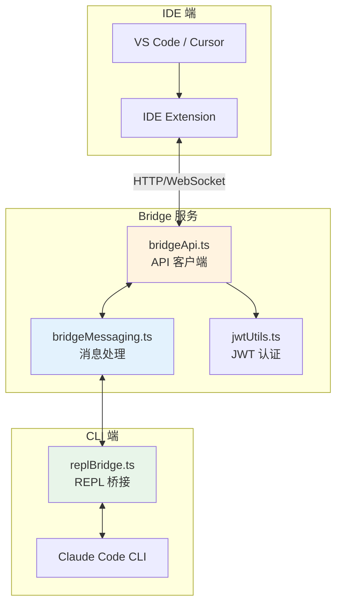
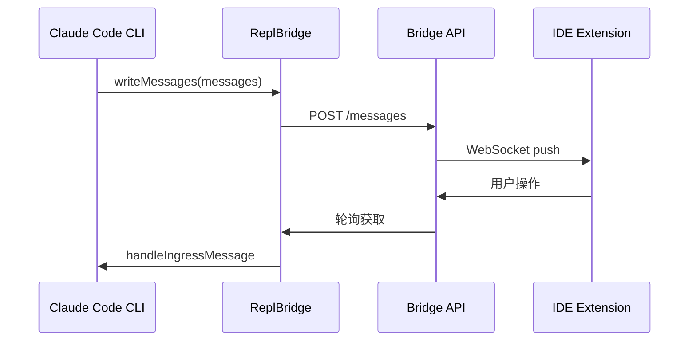
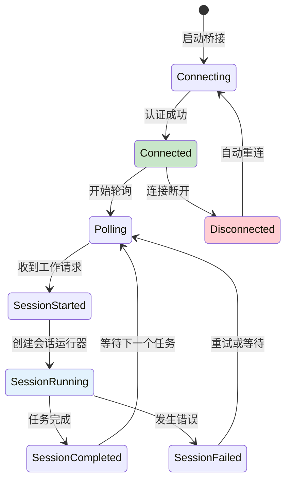
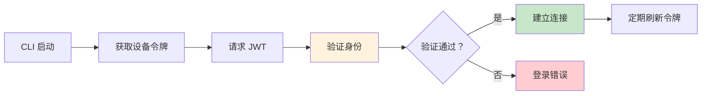
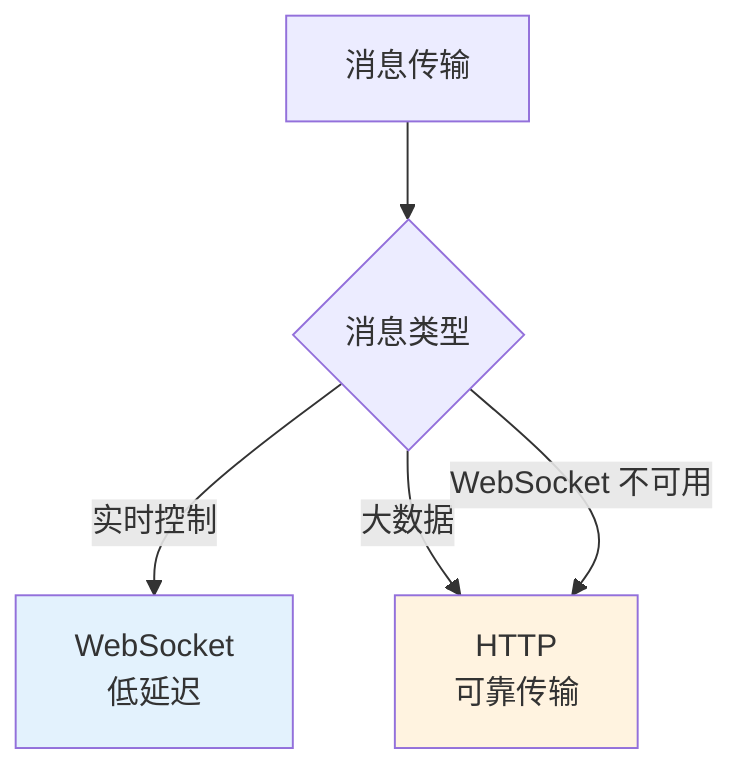
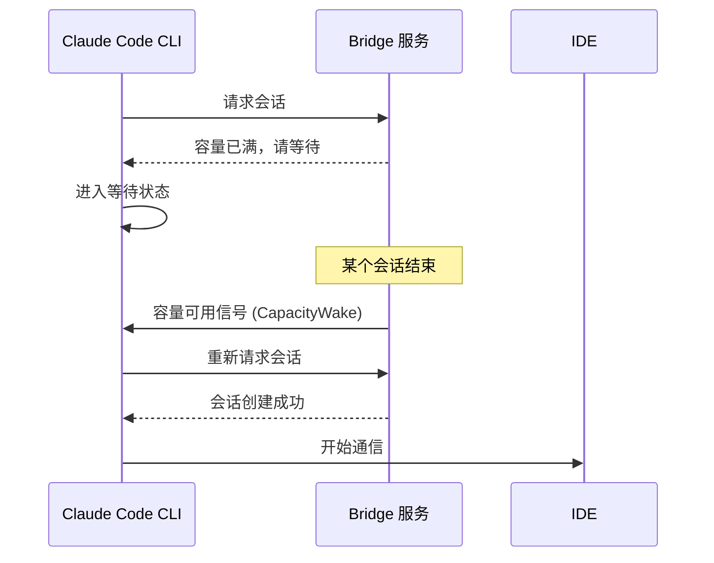
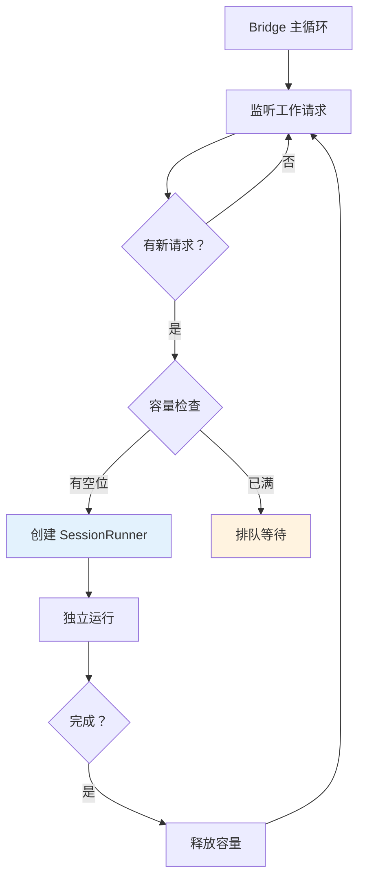
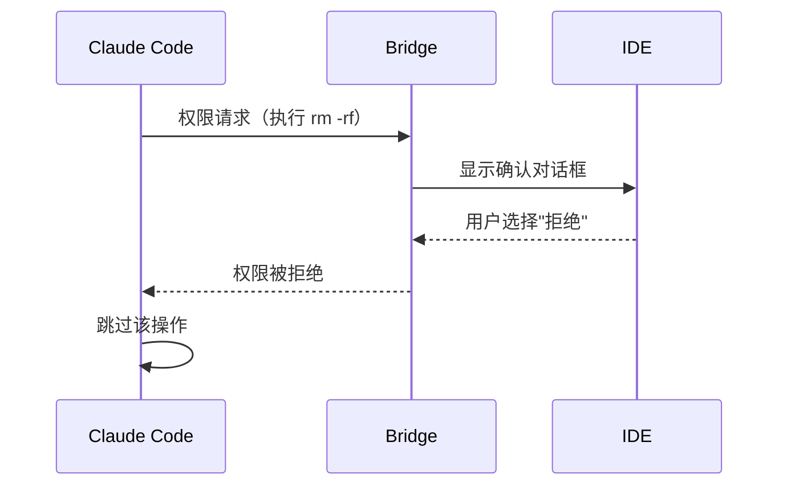

# 第八课：双向传送门 —— IDE 桥接系统详解

> 🎯 对应漫画：第 8 张《双向传送门》

---

## 学习目标

1. 理解 Bridge 桥接系统的设计目的与整体架构
2. 掌握 CLI ↔ IDE 的双向通信机制
3. 了解会话管理与多会话调度
4. 理解消息路由、认证和传输层设计
5. 学会远程桥接和 Capacity Wake 机制

---

## 一、生活类比：翻译官

你（CLI 终端）和一个外国商人（IDE）要谈生意：

- **翻译官**（Bridge）站在中间，把你的话翻译给对方听，也把对方的话翻译给你听
- 翻译官需要**认证**（JWT）——确认双方身份
- 翻译官需要**同步**——确保两边信息一致
- 即使网络断了，翻译官也能**重连**恢复对话

Claude Code 的 Bridge 系统就是 CLI 和 IDE 之间的"翻译官"。

---

## 二、Bridge 系统架构

### 2.1 核心模块

```
bridge/
├── bridgeMain.ts         ← 主入口，多会话管理
├── replBridge.ts         ← REPL 桥接，单会话管理
├── bridgeApi.ts          ← API 客户端
├── bridgeMessaging.ts    ← 消息处理
├── bridgeConfig.ts       ← 配置管理
├── bridgePermissionCallbacks.ts ← 权限回调
├── bridgeUI.ts           ← UI 日志
├── bridgeStatusUtil.ts   ← 状态工具
├── types.ts              ← 类型定义
├── jwtUtils.ts           ← JWT 认证
├── workSecret.ts         ← 工作密钥
├── sessionRunner.ts      ← 会话运行器
├── capacityWake.ts       ← 容量唤醒
└── replBridgeTransport.ts ← 传输层
```

### 2.2 通信架构



---

## 三、ReplBridge：单会话桥接

### 3.1 桥接句柄

```typescript
// 源码：bridge/replBridge.ts — ReplBridgeHandle
export type ReplBridgeHandle = {
  bridgeSessionId: string         // 桥接会话 ID
  environmentId: string           // 环境 ID
  sessionIngressUrl: string       // 入站 URL
  writeMessages(messages: Message[]): void     // 发送消息
  writeSdkMessages(messages: SDKMessage[]): void  // 发送 SDK 消息
  sendControlRequest(request): void   // 发送控制请求
  sendControlResponse(response): void // 发送控制响应
  sendResult(): void              // 发送结果
  teardown(): Promise<void>       // 清理
}
```

### 3.2 消息写入



---

## 四、BridgeMain：多会话管理

### 4.1 核心设计

`bridgeMain.ts` 是 Bridge 系统的"总指挥"，管理多个会话：

```typescript
// 源码：bridge/bridgeMain.ts（概念结构）
// 核心职责：
// 1. 连接到 Bridge 服务器
// 2. 监听新的工作请求
// 3. 为每个请求创建独立的会话
// 4. 管理会话的生命周期
// 5. 处理重连和错误恢复
```

### 4.2 会话生命周期



### 4.3 退避重连

```typescript
// 源码：bridge/bridgeMain.ts — 退避配置
const DEFAULT_BACKOFF: BackoffConfig = {
  connInitialMs: 2_000,       // 首次重连等待 2 秒
  connCapMs: 120_000,         // 最大等待 2 分钟
  connGiveUpMs: 600_000,      // 10 分钟后放弃
  generalInitialMs: 500,      // 一般错误首次等待 0.5 秒
  generalCapMs: 30_000,       // 最大 30 秒
  generalGiveUpMs: 600_000,   // 10 分钟后放弃
}
```

退避策略：指数退避 + 上限

```
第 1 次重连：2 秒
第 2 次重连：4 秒
第 3 次重连：8 秒
...
最大等待：120 秒
总放弃时间：600 秒
```

---

## 五、认证与安全

### 5.1 JWT 令牌管理

```typescript
// 源码：bridge/jwtUtils.ts（概念）
// JWT 令牌用于认证 CLI 和 Bridge 服务
// 支持令牌刷新（避免过期）
export function createTokenRefreshScheduler() {
  // 定期检查令牌有效期
  // 在过期前自动刷新
}
```

### 5.2 可信设备

```typescript
// 源码：bridge/trustedDevice.ts（概念）
export function getTrustedDeviceToken() {
  // 获取设备信任令牌
  // 用于识别和验证已知设备
}
```

### 5.3 工作密钥

```typescript
// 源码：bridge/workSecret.ts
export function decodeWorkSecret(secret: string) {
  // 解码工作密钥
  // 用于安全地传递会话信息
}

export function buildSdkUrl(config) {
  // 构建 SDK 连接 URL
  // 包含认证信息
}
```

### 5.4 认证流程



---

## 六、消息处理

### 6.1 入站消息处理

```typescript
// 源码：bridge/bridgeMessaging.ts
export function handleIngressMessage(message) {
  // 处理从 IDE 发来的消息
  // 类型判断、格式转换、路由分发
}

export function isEligibleBridgeMessage(message) {
  // 检查消息是否可以通过桥接传输
}

export function extractTitleText(message) {
  // 提取消息标题用于显示
}
```

### 6.2 消息去重

```typescript
// 源码：bridge/bridgeMessaging.ts
export class BoundedUUIDSet {
  // 有限大小的 UUID 集合
  // 用于消息去重
  // 防止同一消息被处理多次
}
```

### 6.3 入站附件

```typescript
// 源码：bridge/inboundAttachments.ts（概念）
// 处理从 IDE 传入的附件（文件、图片等）
// 转换为 Claude Code 内部格式
```

---

## 七、传输层

### 7.1 V1 与 V2 传输

```typescript
// 源码：bridge/replBridgeTransport.ts
export function createV1ReplTransport() {
  // V1 传输：基于 HTTP 轮询
}

export function createV2ReplTransport() {
  // V2 传输：基于 WebSocket（更低延迟）
}
```

### 7.2 混合传输

```typescript
// 引用：cli/transports/HybridTransport.ts
// 混合传输：结合 HTTP 和 WebSocket
// WebSocket 用于实时消息
// HTTP 用于大数据传输和兜底
```



---

## 八、Capacity Wake：容量唤醒

### 8.1 什么是 Capacity Wake？

当 Bridge 服务器繁忙时，CLI 可以进入"等待"状态。一旦有可用容量，系统会**唤醒**等待的客户端：

```typescript
// 源码：bridge/capacityWake.ts
export function createCapacityWake(): CapacitySignal {
  // 创建容量信号
  // 当服务端有空闲容量时触发
  // CLI 被唤醒并开始处理
}
```

### 8.2 工作原理



---

## 九、会话运行器

### 9.1 SessionRunner

```typescript
// 源码：bridge/sessionRunner.ts
export function createSessionSpawner(): SessionSpawner {
  // 创建会话生成器
  // 管理会话的创建和销毁
}

export function safeFilenameId(id: string): string {
  // 将会话 ID 转换为安全的文件名
  // 用于日志和临时文件
}
```

### 9.2 多会话管理

```typescript
// 源码：bridge/bridgeMain.ts
const SPAWN_SESSIONS_DEFAULT = 32
// 默认最多同时运行 32 个会话
```



---

## 十、权限桥接

### 10.1 权限回调

```typescript
// 源码：bridge/bridgePermissionCallbacks.ts（概念）
// 当 CLI 需要用户确认权限时
// 通过 Bridge 将权限请求发送到 IDE
// IDE 显示确认对话框
// 用户的选择通过 Bridge 返回 CLI
```



---

## 十一、动手练习

### 练习 1：设计通信协议

假设你要设计一个简化版的 CLI-IDE 桥接系统，需要支持：
- 发送对话消息
- 发送文件变更通知
- 权限确认请求/响应
- 心跳保活

设计消息格式（JSON），包括消息类型、内容、认证信息。

### 练习 2：故障处理

以下场景，Bridge 系统应该如何处理？
1. WebSocket 连接断开，HTTP 正常
2. JWT 令牌过期
3. IDE 端 5 分钟没有响应
4. CLI 端崩溃后重启

### 思考题

1. 为什么需要 V1 和 V2 两种传输协议？
2. 容量唤醒机制解决了什么问题？没有它会怎样？
3. 为什么权限确认要通过 Bridge 传递，而不是 CLI 自己处理？

---

## 十二、本课小结

| 知识点 | 核心内容 |
|--------|----------|
| Bridge 架构 | CLI ↔ Bridge 服务 ↔ IDE 的三层通信 |
| ReplBridge | 单会话桥接，管理一个对话 |
| BridgeMain | 多会话管理，支持 32 个并发 |
| 认证安全 | JWT + 可信设备 + 工作密钥 |
| 传输层 | HTTP 轮询 + WebSocket 实时 |
| Capacity Wake | 容量满时等待，有空时唤醒 |
| 权限桥接 | 权限确认通过 Bridge 传递到 IDE |
| 退避重连 | 指数退避，自动恢复连接 |

**一句话总结**：Claude Code 的 Bridge 系统就像一个**智能翻译官+邮差**——它在 CLI 和 IDE 之间架起双向通道，处理认证、消息路由、断线重连，确保两端能够无缝协作。

---

## 下节预告

> **第九课：百宝袋 —— 插件与技能扩展机制**
>
> Claude Code 不只有内置功能，它还有一个强大的扩展系统。
> 下节课看看 Skills（技能）和 Plugins（插件）如何让 Claude Code 变成"百宝袋"！
