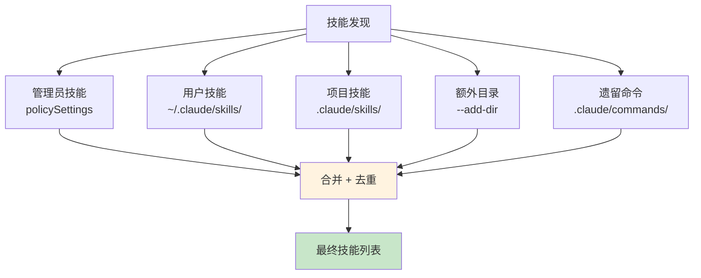
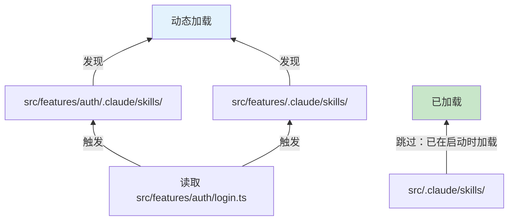
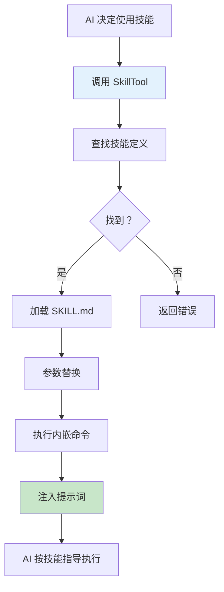

# 第九课：百宝袋 —— 插件与技能扩展机制

> 🎯 对应漫画：第 9 张《百宝袋》

---

## 学习目标

1. 理解 Skills（技能）和 Plugins（插件）的区别与联系
2. 掌握 SKILL.md 文件的编写规范与 frontmatter 配置
3. 了解技能的多级发现机制（用户/项目/管理/动态/条件）
4. 理解内置插件的注册与管理系统
5. 学会 MCP 技能发现与集成方式

---

## 一、生活类比：手机的 App 生态

你的手机（Claude Code）出厂自带一些 App（内置工具），但你还可以：

- **自定义快捷指令**（Skills）—— 像 iOS 快捷指令，用简单文件定义复杂流程
- **安装应用**（Plugins）—— 像 App Store，安装第三方功能包
- **连接外部服务**（MCP）—— 像蓝牙配对，连接外部工具

这就是 Claude Code 的扩展三件套：**Skills + Plugins + MCP**。

---

## 二、Skills（技能）系统

### 2.1 什么是技能？

技能就是一个 **Markdown 文件**（SKILL.md），里面用自然语言描述一个任务的执行方式。AI 读到这个文件后就知道怎么做。

```
.claude/skills/
└── deploy/
    └── SKILL.md    ← 部署技能
```

### 2.2 SKILL.md 格式

```markdown
---
name: deploy
description: 部署应用到生产环境
when_to_use: 当用户要求部署或发布时
allowed-tools:
  - Bash(npm run build)
  - Bash(aws s3 sync *)
  - Bash(aws cloudfront create-invalidation *)
argument-hint: "[环境名称]"
arguments:
  - environment
---

# 部署流程

1. 运行构建: `npm run build`
2. 上传到 S3: `aws s3 sync dist/ s3://my-bucket/${environment}/`
3. 清除 CDN 缓存: `aws cloudfront create-invalidation --distribution-id XXX --paths "/*"`
4. 验证部署: 访问 https://${environment}.example.com 确认正常
```

### 2.3 Frontmatter 字段详解

```typescript
// 源码：skills/loadSkillsDir.ts — parseSkillFrontmatterFields
export function parseSkillFrontmatterFields(
  frontmatter: FrontmatterData,
  markdownContent: string,
  resolvedName: string,
): {
  displayName: string | undefined      // 显示名称
  description: string                  // 描述
  allowedTools: string[]               // 允许使用的工具
  argumentHint: string | undefined     // 参数提示
  argumentNames: string[]              // 参数名列表
  whenToUse: string | undefined        // AI 何时自动调用
  version: string | undefined          // 版本
  model: string | undefined            // 指定模型
  disableModelInvocation: boolean      // 禁止 AI 自动调用
  userInvocable: boolean               // 用户是否可通过 / 调用
  hooks: HooksSettings | undefined     // 关联的钩子
  executionContext: 'fork' | undefined // 执行上下文
  agent: string | undefined            // 关联的 agent 类型
  effort: EffortValue | undefined      // 努力程度
  shell: FrontmatterShell | undefined  // Shell 配置
} { /* ... */ }
```

| 字段 | 作用 | 示例 |
|------|------|------|
| `name` | 技能名称 | `deploy` |
| `description` | 描述（给 AI 和用户看） | `部署到生产环境` |
| `when_to_use` | AI 何时自动使用 | `当用户要求部署时` |
| `allowed-tools` | 允许的工具及参数 | `Bash(npm run *)` |
| `arguments` | 接受的参数 | `environment` |
| `user-invocable` | 用户能否用 `/skill` 调用 | `true` |
| `model` | 使用哪个模型 | `haiku`（轻量任务） |
| `paths` | 条件激活路径 | `src/deploy/**` |
| `context` | 执行上下文 | `fork`（独立分支） |

---

## 三、技能发现机制

### 3.1 五层发现源



```typescript
// 源码：skills/loadSkillsDir.ts — getSkillDirCommands
export const getSkillDirCommands = memoize(
  async (cwd: string): Promise<Command[]> => {
    // 并行加载所有来源
    const [
      managedSkills,       // 管理员配置的
      userSkills,          // 用户全局的
      projectSkillsNested, // 项目级的
      additionalSkillsNested, // 额外目录的
      legacyCommands,      // 遗留命令目录的
    ] = await Promise.all([...])

    // 去重（相同文件只加载一次）
    // 优先级：管理员 > 用户 > 项目
    return deduplicatedSkills
  }
)
```

### 3.2 去重机制

```typescript
// 源码：skills/loadSkillsDir.ts — 通过 realpath 去重
async function getFileIdentity(filePath: string): Promise<string | null> {
  try {
    return await realpath(filePath)
  } catch {
    return null
  }
}

// 即使通过符号链接或不同路径引用
// 只要真实路径相同，就只加载一次
```

### 3.3 动态技能发现

当 AI 操作文件时，系统会**自动发现**文件附近的技能目录：

```typescript
// 源码：skills/loadSkillsDir.ts — discoverSkillDirsForPaths
export async function discoverSkillDirsForPaths(
  filePaths: string[],
  cwd: string,
): Promise<string[]> {
  for (const filePath of filePaths) {
    let currentDir = dirname(filePath)
    // 从文件所在目录向上遍历到 cwd
    while (currentDir.startsWith(resolvedCwd + pathSep)) {
      const skillDir = join(currentDir, '.claude', 'skills')
      // 检查目录是否存在
      // 检查是否被 gitignore
      // 如果存在且未忽略，加入发现列表
    }
  }
}
```



### 3.4 条件技能激活

技能可以配置 `paths` 字段，只在操作匹配路径时才激活：

```typescript
// 源码：skills/loadSkillsDir.ts — activateConditionalSkillsForPaths
export function activateConditionalSkillsForPaths(
  filePaths: string[],
  cwd: string,
): string[] {
  for (const [name, skill] of conditionalSkills) {
    const skillIgnore = ignore().add(skill.paths)
    for (const filePath of filePaths) {
      if (skillIgnore.ignores(relativePath)) {
        // 匹配！激活这个技能
        dynamicSkills.set(name, skill)
        conditionalSkills.delete(name)
      }
    }
  }
}
```

---

## 四、技能创建命令

### 4.1 createSkillCommand

每个技能最终被转换为一个 `Command` 对象：

```typescript
// 源码：skills/loadSkillsDir.ts — createSkillCommand
export function createSkillCommand({
  skillName,
  markdownContent,
  allowedTools,
  ...
}): Command {
  return {
    type: 'prompt',
    name: skillName,
    description,
    allowedTools,
    async getPromptForCommand(args, toolUseContext) {
      let finalContent = markdownContent

      // 替换参数：${environment} → production
      finalContent = substituteArguments(finalContent, args, ...)

      // 替换技能目录变量
      finalContent = finalContent.replace(
        /\$\{CLAUDE_SKILL_DIR\}/g, skillDir
      )

      // 替换会话 ID 变量
      finalContent = finalContent.replace(
        /\$\{CLAUDE_SESSION_ID\}/g, getSessionId()
      )

      // 执行内嵌 Shell 命令（非 MCP 技能）
      if (loadedFrom !== 'mcp') {
        finalContent = await executeShellCommandsInPrompt(...)
      }

      return [{ type: 'text', text: finalContent }]
    }
  }
}
```

### 4.2 变量替换

技能支持多种变量：

| 变量 | 含义 | 示例 |
|------|------|------|
| `${1}` / `${environment}` | 用户传入的参数 | `production` |
| `${CLAUDE_SKILL_DIR}` | 技能所在目录 | `/path/to/skill/` |
| `${CLAUDE_SESSION_ID}` | 当前会话 ID | `abc123` |

---

## 五、Plugins（插件）系统

### 5.1 内置插件

```typescript
// 源码：plugins/builtinPlugins.ts
const BUILTIN_PLUGINS: Map<string, BuiltinPluginDefinition> = new Map()

export function registerBuiltinPlugin(
  definition: BuiltinPluginDefinition,
): void {
  BUILTIN_PLUGINS.set(definition.name, definition)
}
```

### 5.2 插件 vs 技能

| 维度 | 技能（Skill） | 插件（Plugin） |
|------|---------------|----------------|
| 格式 | Markdown 文件 | 代码包 |
| 复杂度 | 简单流程 | 复杂功能 |
| 组成 | 单个 SKILL.md | 技能 + 钩子 + MCP |
| 管理 | 文件系统 | /plugin UI 开关 |
| ID 格式 | 名称 | `name@builtin` |

### 5.3 内置插件管理

```typescript
// 源码：plugins/builtinPlugins.ts — getBuiltinPlugins
export function getBuiltinPlugins(): {
  enabled: LoadedPlugin[]
  disabled: LoadedPlugin[]
} {
  const settings = getSettings_DEPRECATED()
  for (const [name, definition] of BUILTIN_PLUGINS) {
    // 检查可用性
    if (definition.isAvailable && !definition.isAvailable()) continue

    // 检查用户设置
    const userSetting = settings?.enabledPlugins?.[pluginId]
    const isEnabled = userSetting !== undefined
      ? userSetting === true
      : (definition.defaultEnabled ?? true)  // 默认启用

    // 分类到 enabled 或 disabled
  }
}
```

### 5.4 插件提供的技能

```typescript
// 源码：plugins/builtinPlugins.ts — getBuiltinPluginSkillCommands
export function getBuiltinPluginSkillCommands(): Command[] {
  const { enabled } = getBuiltinPlugins()
  const commands: Command[] = []
  for (const plugin of enabled) {
    const definition = BUILTIN_PLUGINS.get(plugin.name)
    if (!definition?.skills) continue
    for (const skill of definition.skills) {
      commands.push(skillDefinitionToCommand(skill))
    }
  }
  return commands
}
```

---

## 六、MCP 技能集成

### 6.1 从 MCP 服务器发现技能

```typescript
// 源码：skills/mcpSkillBuilders.ts
// MCP 服务器可以暴露技能定义
// Claude Code 自动发现并注册这些技能
export function registerMCPSkillBuilders(builders) {
  // 注册 MCP 技能构建器
  // 复用 createSkillCommand 和 parseSkillFrontmatterFields
}
```

### 6.2 安全限制

```typescript
// 源码：skills/loadSkillsDir.ts
// MCP 技能是远程和不受信任的
// 不执行内嵌 Shell 命令
if (loadedFrom !== 'mcp') {
  finalContent = await executeShellCommandsInPrompt(...)
}
```

---

## 七、SkillTool：技能调用工具

### 7.1 SkillTool 是什么？

`SkillTool` 是 AI 调用技能的接口——当 AI 认为需要使用某个技能时，通过 `SkillTool` 调用：

```typescript
// 源码：tools/SkillTool/SkillTool.js（概念）
// AI 调用：SkillTool({ name: "deploy", arguments: "production" })
// SkillTool 找到对应的 SKILL.md
// 加载内容、替换参数
// 将结果作为提示词注入
```

### 7.2 调用流程



---

## 八、技能的高级特性

### 8.1 条件路径激活

```yaml
---
name: react-lint
paths:
  - src/components/**
  - src/hooks/**
---
# React 代码规范检查
当编辑 React 组件时自动激活...
```

### 8.2 Fork 执行上下文

```yaml
---
name: risky-refactor
context: fork
---
# 高风险重构
在独立分支中执行，不影响主分支...
```

### 8.3 指定模型

```yaml
---
name: quick-format
model: haiku
---
# 快速格式化
简单任务，用轻量模型即可...
```

### 8.4 关联钩子

```yaml
---
name: deploy
hooks:
  PostToolUse:
    - matcher: Bash
      hooks:
        - command: "./scripts/validate-deploy.sh"
---
```

---

## 九、动手练习

### 练习 1：编写一个技能

为你的项目编写一个 `code-review` 技能（SKILL.md），要求：
1. 检查当前 Git 分支的所有变更
2. 对每个变更文件进行代码审查
3. 生成审查报告
4. 配置合适的 `allowed-tools` 和 `when_to_use`

### 练习 2：设计插件

设计一个"数据库迁移"插件，包含：
1. 3 个技能：`db:create`、`db:migrate`、`db:rollback`
2. 每个技能需要哪些参数？
3. 安全权限配置（哪些操作需要确认？）

### 思考题

1. 技能为什么用 Markdown 而不是代码定义？有什么优缺点？
2. 动态技能发现和启动时全部加载相比，各有什么优势？
3. 为什么 MCP 技能不允许执行内嵌 Shell 命令？

---

## 十、本课小结

| 知识点 | 核心内容 |
|--------|----------|
| 技能（Skills） | Markdown 定义的可复用任务模板 |
| SKILL.md | frontmatter 配置 + Markdown 内容 |
| 五层发现 | 管理员/用户/项目/额外目录/遗留命令 |
| 动态发现 | 操作文件时自动发现附近的技能 |
| 条件激活 | paths 字段匹配时才激活 |
| 插件（Plugins） | 多组件功能包（技能+钩子+MCP） |
| 内置插件 | 内置可开关的功能包 |
| MCP 技能 | 从远程 MCP 服务器发现的技能 |

**一句话总结**：Claude Code 的扩展系统就像一个**开放的百宝袋**——你可以用简单的 Markdown 文件创建自定义技能，用插件安装复杂功能，用 MCP 连接外部服务，让 Claude Code 做到几乎任何事情。

---

## 下节预告

> **第十课：王者对决 —— Claude Code 与竞品对比分析**
>
> 最后一课，我们跳出代码，从产品和技术角度全面对比 Claude Code
> 与 GitHub Copilot、Cursor、Cline、Aider 等竞品，看看它的独特优势在哪里！
