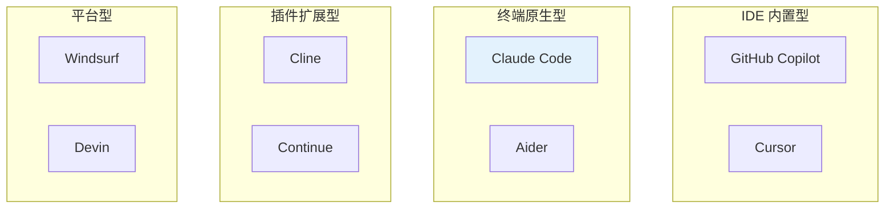
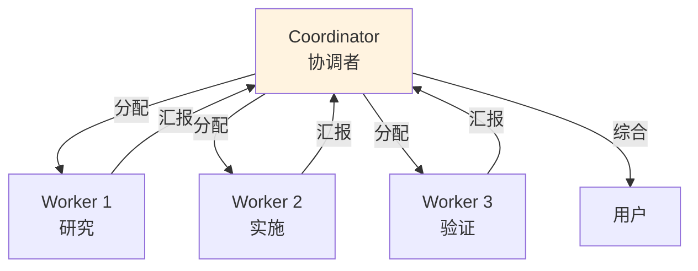
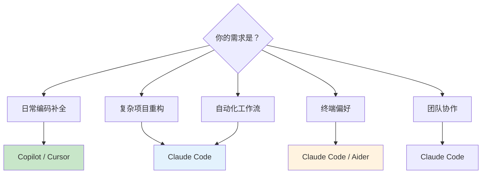
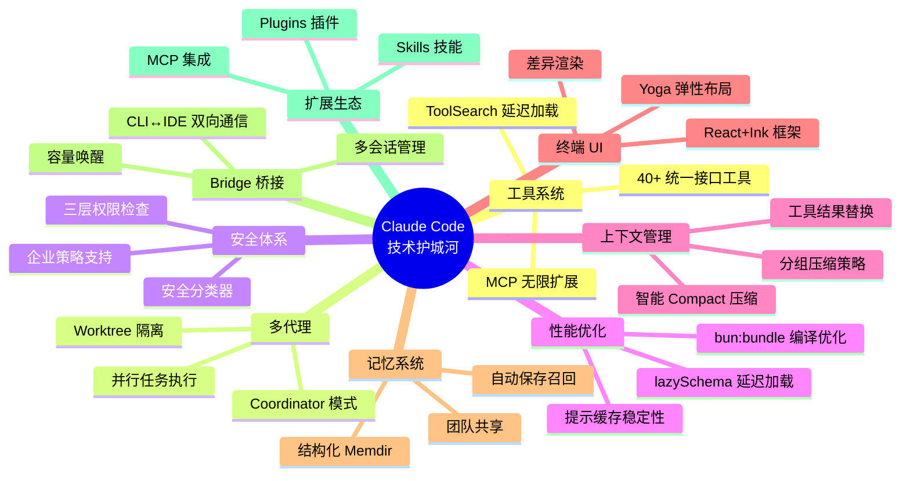
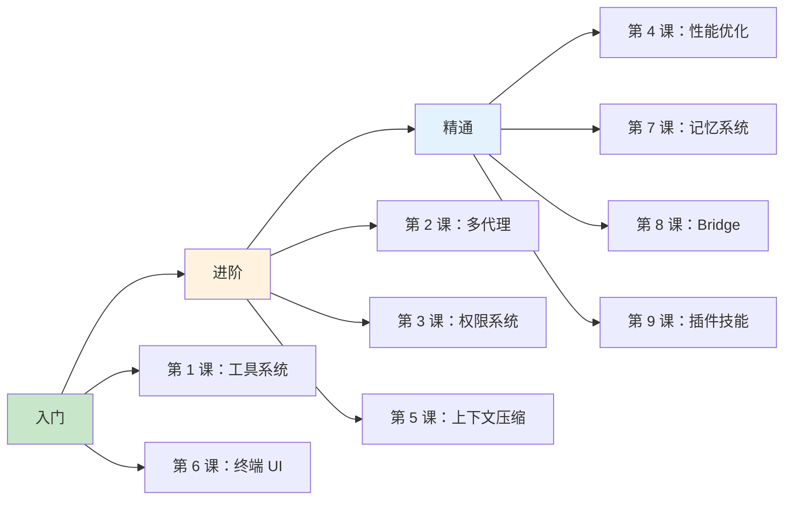

# 第十课：王者对决 —— Claude Code 与竞品对比分析

> 🎯 对应漫画：第 10 张《王者对决》

---

## 学习目标

1. 了解 AI 编程助手的市场格局与主要玩家
2. 从架构设计角度对比 Claude Code 与竞品
3. 理解各产品在工具系统、多代理、权限管理等方面的差异
4. 掌握 Claude Code 的独特技术优势
5. 学会根据场景选择合适的 AI 编程工具

---

## 一、生活类比：选车

选 AI 编程助手就像选车：

- **GitHub Copilot** —— 丰田卡罗拉：市场占有率最高，稳定可靠，集成度高
- **Cursor** —— 特斯拉：创新 UI 体验，深度 IDE 集成
- **Claude Code** —— F1 赛车：终端原生，性能极致，多代理协同
- **Aider** —— 改装吉普：开源灵活，社区驱动
- **Cline** —— 混合动力 SUV：VS Code 插件，多模型支持

每种车都有适合的赛道——选对场景比选对品牌更重要。

---

## 二、竞品全景图



---

## 三、核心维度对比

### 3.1 架构设计对比

| 维度 | Claude Code | Copilot | Cursor | Aider | Cline |
|------|------------|---------|--------|-------|-------|
| 运行环境 | 终端 CLI | IDE 内置 | 定制 IDE | 终端 CLI | VS Code 插件 |
| UI 框架 | React+Ink | IDE 原生 | Electron | 纯文本 | WebView |
| 模型支持 | Claude 系列 | GPT 系列 + Claude | 多模型 | 多模型 | 多模型 |
| 开源 | 部分开源 | 闭源 | 闭源 | 完全开源 | 完全开源 |

### 3.2 从源码看 Claude Code 的独特之处

回顾前九课学到的内容，Claude Code 有几个其他工具没有（或做得不够好）的能力：

---

## 四、工具系统对比

### 4.1 Claude Code 的 40+ 工具

回顾第一课，Claude Code 有一个**统一的工具抽象**：

```typescript
// Claude Code 的工具接口（第一课）
type Tool = {
  name: string
  call(args, context): Result
  isReadOnly(input): boolean
  isDestructive(input): boolean
  checkPermissions(input, ctx): PermissionResult
  // ...
}
```

每个工具都有统一的权限检查、并发控制、结果大小限制。

### 4.2 竞品对比

| 特性 | Claude Code | Copilot | Cursor | Aider | Cline |
|------|------------|---------|--------|-------|-------|
| 工具数量 | 40+ | ~10 | ~15 | ~5 | ~10 |
| 统一工具接口 | ✅ | ❌ | 部分 | ❌ | 部分 |
| 工具权限控制 | 三层安全 | 基础 | 中等 | 基础 | 基础 |
| MCP 协议支持 | ✅ | ✅ | ✅ | ❌ | ✅ |
| 工具延迟加载 | ✅ ToolSearch | ❌ | ❌ | ❌ | ❌ |
| 并发安全标记 | ✅ | ❌ | ❌ | ❌ | ❌ |

**Claude Code 优势**：统一的工具抽象使得每个工具都有一致的安全保障和行为规范，这是其他工具做不到的。

---

## 五、多代理协同对比

### 5.1 Claude Code 的 Coordinator 模式

回顾第二课，Claude Code 有成熟的多代理架构：



### 5.2 竞品对比

| 特性 | Claude Code | Copilot | Cursor | Aider | Cline |
|------|------------|---------|--------|-------|-------|
| 多代理协同 | ✅ Coordinator | ❌ | ❌ | ❌ | ❌ |
| 并行任务 | ✅ | ❌ | ❌ | ❌ | ❌ |
| 代理间通信 | ✅ task-notification | - | - | - | - |
| Worktree 隔离 | ✅ | ❌ | ❌ | ✅ | ❌ |
| Agent Swarm | ✅ | ❌ | ❌ | ❌ | ❌ |
| 代理续写 | ✅ SendMessage | - | - | - | - |

**Claude Code 优势**：唯一支持真正的多代理并行协同的 CLI 工具。这意味着复杂任务可以被拆分成多个子任务同时执行。

---

## 六、权限安全对比

### 6.1 Claude Code 的三层安全

回顾第三课的三层架构：

```
第一层：规则匹配（Allow/Deny/Ask 规则）
第二层：分类器（YOLO 安全分类器）
第三层：用户审批（交互式确认）
```

### 6.2 竞品对比

| 特性 | Claude Code | Copilot | Cursor | Aider | Cline |
|------|------------|---------|--------|-------|-------|
| 权限层级 | 三层 | 一层 | 二层 | 一层 | 二层 |
| 规则系统 | ✅ 分层规则 | ❌ | 基础 | ❌ | 基础 |
| 安全分类器 | ✅ | ❌ | ❌ | ❌ | ❌ |
| 记住选择 | ✅ 持久化 | - | ✅ | ❌ | ✅ |
| 沙箱执行 | ✅ | ❌ | ❌ | ❌ | ❌ |
| 企业策略 | ✅ | ✅ | ❌ | ❌ | ❌ |

**Claude Code 优势**：最完善的权限安全体系，特别是安全分类器和企业策略支持，适合团队和企业环境。

---

## 七、上下文管理对比

### 7.1 Claude Code 的四层压缩

回顾第五课：

```
Compact 摘要压缩 → 分组策略 → 工具结果替换 → 微压缩
```

### 7.2 竞品对比

| 特性 | Claude Code | Copilot | Cursor | Aider | Cline |
|------|------------|---------|--------|-------|-------|
| 自动压缩 | ✅ 多层 | ❌ | ✅ 基础 | ✅ | ✅ 基础 |
| 压缩策略 | 智能分组 | - | 截断 | 摘要 | 截断 |
| 工具结果管理 | ✅ 替换+引用 | - | 基础 | 基础 | 基础 |
| 提示缓存 | ✅ 排序优化 | ✅ | ✅ | ❌ | ❌ |
| 压缩钩子 | ✅ Pre/Post | ❌ | ❌ | ❌ | ❌ |

**Claude Code 优势**：最智能的上下文管理，通过分组压缩和工具结果替换，在保留关键信息的同时最大化上下文利用率。

---

## 八、记忆系统对比

### 8.1 Claude Code 的 Memdir

回顾第七课：

```
MEMORY.md 索引 → 主题文件 → 四种类型 → 自动保存 → 团队共享
```

### 8.2 竞品对比

| 特性 | Claude Code | Copilot | Cursor | Aider | Cline |
|------|------------|---------|--------|-------|-------|
| 持久记忆 | ✅ 文件化 | ❌ | ✅ 基础 | ❌ | ❌ |
| 记忆类型 | 4 种分类 | - | 自由文本 | - | - |
| 自动保存 | ✅ | ❌ | ❌ | ❌ | ❌ |
| 团队共享 | ✅ | ❌ | ❌ | ❌ | ❌ |
| 搜索召回 | ✅ | ❌ | 基础 | ❌ | ❌ |
| 跨会话 | ✅ | ❌ | ✅ | ❌ | ❌ |

**Claude Code 优势**：唯一有完整的结构化记忆系统，支持自动保存、类型分类和团队共享。

---

## 九、扩展生态对比

### 9.1 Claude Code 的三套扩展

回顾第九课：

```
Skills（Markdown 技能）+ Plugins（插件包）+ MCP（外部服务）
```

### 9.2 竞品对比

| 特性 | Claude Code | Copilot | Cursor | Aider | Cline |
|------|------------|---------|--------|-------|-------|
| 自定义命令 | ✅ Skills | ❌ | ✅ Rules | ❌ | ❌ |
| 插件系统 | ✅ | ✅ 扩展 | ❌ | ❌ | ❌ |
| MCP 支持 | ✅ | ✅ | ✅ | ❌ | ✅ |
| 条件激活 | ✅ paths | ❌ | ❌ | ❌ | ❌ |
| 动态发现 | ✅ | ❌ | ❌ | ❌ | ❌ |
| 钩子系统 | ✅ | ❌ | ❌ | ❌ | ❌ |

---

## 十、适用场景分析

### 10.1 选择指南



### 10.2 场景推荐

| 场景 | 推荐工具 | 原因 |
|------|----------|------|
| 写代码时的自动补全 | Copilot | 最快的实时补全 |
| IDE 中的对话式编程 | Cursor | 深度 IDE 集成 |
| 复杂多文件重构 | Claude Code | 多代理并行 |
| CI/CD 自动化 | Claude Code | 终端原生 + Skills |
| 开源项目贡献 | Aider | 完全开源 + 多模型 |
| 企业团队开发 | Claude Code | 权限 + 记忆 + 团队共享 |
| 快速原型开发 | Cursor | 直观 UI |
| 生产环境运维 | Claude Code | 安全分类器 + 沙箱 |

---

## 十一、Claude Code 的技术护城河

通过前九课的学习，我们可以总结 Claude Code 的核心技术护城河：

### 11.1 架构级优势



### 11.2 组合优势

单独看每个能力，竞品可能在某一点上做得不错。但 Claude Code 的真正优势在于**这些能力的组合**：

- 多代理 + 权限系统 = **安全的并行执行**
- 记忆系统 + 上下文压缩 = **持久且高效的上下文**
- 工具系统 + 技能扩展 = **无限可定制的能力**
- Bridge + 终端 UI = **灵活的使用方式**

---

## 十二、动手练习

### 练习 1：功能矩阵

根据你的实际工作需求，为以下 5 个场景打分（1-5 分）：

| 场景 | 你的权重 |
|------|----------|
| 代码补全速度 | ? |
| 多文件修改 | ? |
| 安全性 | ? |
| 定制化 | ? |
| 团队协作 | ? |

然后用加权评分法，计算哪个工具最适合你。

### 练习 2：技术架构分析

选择一个竞品（如 Aider 或 Cline），阅读其开源代码，与 Claude Code 对比：
1. 它的工具系统是如何设计的？
2. 它如何处理上下文超限？
3. 它有权限控制吗？

### 思考题

1. 为什么 Claude Code 选择终端而不是 IDE 作为主要界面？
2. 多代理协同在什么场景下反而不如单代理？
3. 如果你要设计下一代 AI 编程助手，你会保留 Claude Code 的哪些设计，改进哪些？

---

## 十三、课程总结

### 全系列回顾

| 课程 | 核心知识 | 一句话精华 |
|------|----------|------------|
| 第 1 课 | 工具系统 | 统一的工具抽象，40+ 工具按需加载 |
| 第 2 课 | 多代理 | 项目经理+工人的协调模式 |
| 第 3 课 | 权限安全 | 三道门：规则→分类器→用户确认 |
| 第 4 课 | 性能优化 | 从编译到运行的全链路优化 |
| 第 5 课 | 上下文压缩 | 智能图书管理员的四层压缩术 |
| 第 6 课 | 终端 UI | React+Ink+Yoga 的终端图形化 |
| 第 7 课 | 记忆系统 | 文件化的自动笔记系统 |
| 第 8 课 | Bridge 桥接 | CLI↔IDE 的双向翻译官 |
| 第 9 课 | 插件技能 | Markdown 定义的开放百宝袋 |
| 第 10 课 | 竞品对比 | 组合优势构筑技术护城河 |

### 学习路线建议



---

**恭喜你完成了全部 10 节课的学习！**

你现在已经对 Claude Code 的内部架构有了全面而深入的理解。无论是工具系统、多代理协同、权限安全，还是性能优化、记忆管理、扩展机制——这些知识不仅帮助你更好地使用 Claude Code，也为你设计自己的 AI 系统提供了宝贵的参考。

**继续探索源码，继续创造！**
